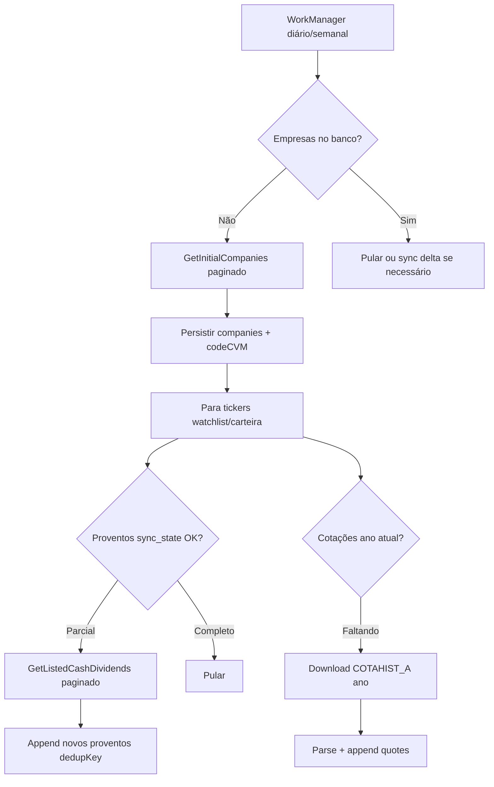
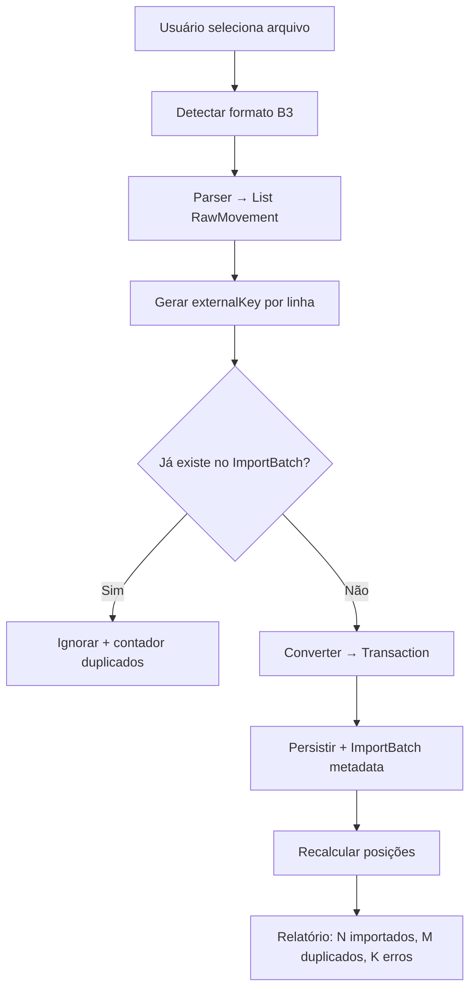
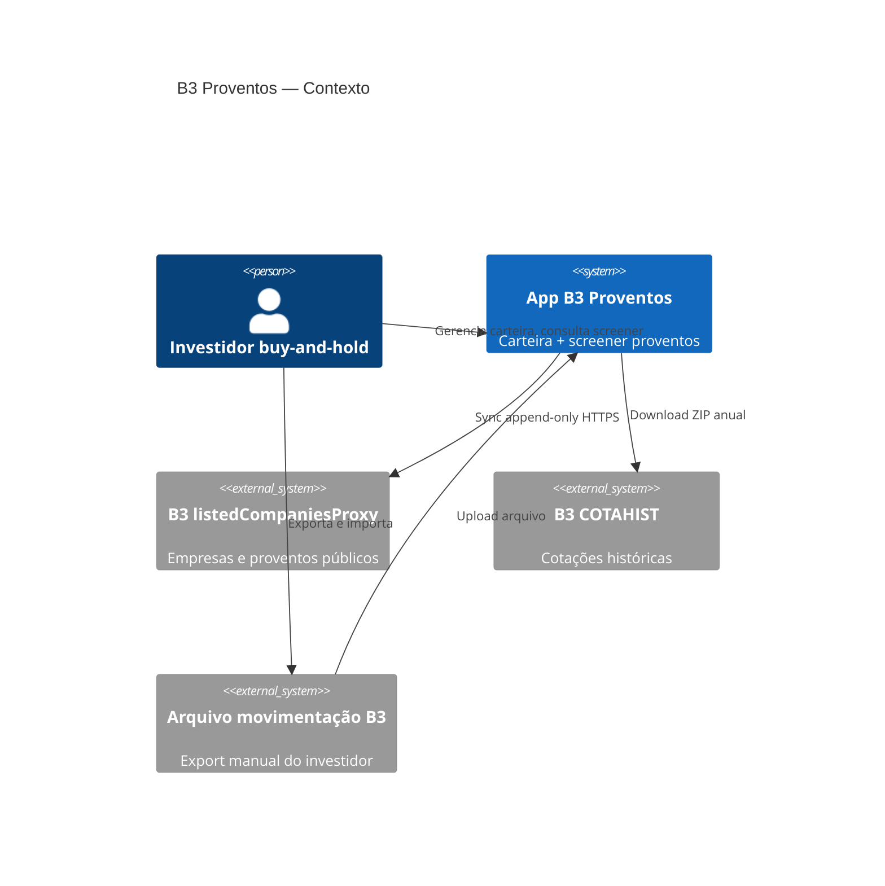

# B3 Proventos — Estrutura Lógica e Prompt Mestre

> **Objetivo deste documento:** definir a melhor arquitetura, módulos, fluxos de dados e UX para um app Android Kotlin de carteira buy-and-hold focada em proventos da B3 — **sem implementar código**. Serve como blueprint e como prompt para reconstruir o app do zero ou refatorar o projeto existente em `/home/dfmoura/StudioProjects/b3Proventos/`.

**Referências obrigatórias:**
- Documentação curl/API: `/home/dfmoura/Documents/test_several1/trigger/16/`
- Projeto anterior (referência do que evitar): `/home/dfmoura/StudioProjects/b3Proventos/`

---

## 1. Visão do produto

### 1.1 Proposta de valor

App pessoal para **carteira previdenciária (buy and hold)** na B3, com foco em:

1. **Maximizar proventos recorrentes** — dividendos, JCP e rendimentos.
2. **Acompanhar a carteira real** — posição, custo médio, proventos recebidos por ativo e consolidado.
3. **Descobrir bons pagadores** — ranking inteligente de yield (meta: identificar ativos com yield sustentável acima de ~6% a.a.), indo além de `provento ÷ preço médio`.
4. **Decidir aportes** — cruzar yield histórico com preço spot e capacidade de compra (mais cotas = mais proventos).

### 1.2 O que o app NÃO é

- Não é corretora nem recomendação de investimento.
- Não conecta na Área Logada B3 (sem API de investidor).
- Não substitui IR, contador ou extrato oficial.
- Não promete data de pagamento (a API pública não fornece).

### 1.3 Persona e jornada principal

**Usuário:** investidor buy-and-hold, importa movimentações da B3 periodicamente, quer ver evolução de proventos e encontrar novos ativos pagadores.

**Jornada feliz:**
1. Importa extrato de movimentação B3 (sem duplicar).
2. Vê dashboard da carteira: posição, proventos YTD/12m, yield on cost.
3. Abre screener: empresas com yield histórico > 6% e score de consistência alto.
4. Compara candidatos: histórico 5–10 anos, regularidade, preço spot vs yield.
5. Registra compra manual ou via nova importação.

---

## 2. Restrições e fontes de dados

### 2.1 Restrições hard

| Restrição | Implicação arquitetural |
|-----------|-------------------------|
| Sem API Área Logada B3 | Importação manual de arquivo de movimentação + deduplicação |
| API pública de proventos sem ticker exato | Mapear `typeStock` (ON/PN/PNA/PNB) → ticker via `GetDetail` |
| Proventos sem data de pagamento | Usar `lastDatePriorEx` como referência; deixar claro na UI |
| Dados de mercado append-only | Sync incremental: consultar banco → buscar só o que falta → append |
| Sem filtro de data na API | Baixar histórico completo uma vez; filtrar localmente |

### 2.2 Fontes de dados (3 camadas)

```
┌─────────────────────────────────────────────────────────────────┐
│ CAMADA A — Mercado (público, cache local append-only)           │
├─────────────────────────────────────────────────────────────────┤
│ listedCompaniesProxy (B3)                                       │
│   GetInitialCompanies  → ~3.456 emissores                       │
│   GetDetail            → tickers + ISIN + setor                 │
│   GetListedCashDividends → proventos por tradingName            │
│   GetIndustryClassification → setores                           │
│                                                                 │
│ COTAHIST (SerHist B3)                                           │
│   COTAHIST_A{ano}.ZIP → OHLC diário por ticker                  │
│                                                                 │
│ tickers-cash-market.json (comunitário, opcional bootstrap)      │
│   → lista bulk de tickers + especPapel + intervalo de datas     │
└─────────────────────────────────────────────────────────────────┘

┌─────────────────────────────────────────────────────────────────┐
│ CAMADA B — Carteira (dados do usuário, soberanos)               │
├─────────────────────────────────────────────────────────────────┤
│ Importação arquivo movimentação B3 (CSV/XLS exportado)          │
│ Transações manuais (compra/venda/bonificação/desdobramento)     │
│ Metas e watchlists                                              │
└─────────────────────────────────────────────────────────────────┘

┌─────────────────────────────────────────────────────────────────┐
│ CAMADA C — Derivados (calculados, recalculáveis)                │
├─────────────────────────────────────────────────────────────────┤
│ Posição por ticker (qty, PM, investido)                         │
│ Proventos elegíveis por data ex × qty na data                   │
│ Métricas de yield, scores, rankings                             │
└─────────────────────────────────────────────────────────────────┘
```

### 2.3 Política de sincronização (regra de ouro)

Para **cada entidade externa** (empresa, provento, cotação):

```
1. Verificar no banco local o que já existe (por chave natural)
2. Se completo para o escopo → NÃO chamar API
3. Se parcial → chamar API paginada e APPEND apenas registros novos
4. Nunca UPDATE destrutivo em histórico; nunca DELETE de dados de mercado
5. Registrar sync_state: tradingName/ticker, totalRecords, lastSyncedAt
```

**Chaves de deduplicação:**

| Entidade | Chave natural |
|----------|---------------|
| Provento | `tradingName + typeStock + corporateAction + dateEx + valueCash` |
| Cotação diária | `ticker + date` |
| Transação importada | hash do arquivo + linha OU campos B3 nativos (data+tipo+ticker+qty+valor) |
| Empresa | `codeCVM` ou `ticker` principal |

---

## 3. Arquitetura de software

### 3.1 Padrão recomendado

**Clean Architecture + MVVM + unidirectional data flow (UDF)**

```
┌──────────────────────────────────────────────────────────┐
│ presentation/                                            │
│   ui/ (Compose) + ViewModel + UiState + UiEvent          │
├──────────────────────────────────────────────────────────┤
│ domain/                                                  │
│   model/ + usecase/ + service/ (lógica pura, sem Android)│
├──────────────────────────────────────────────────────────┤
│ data/                                                    │
│   repository/ + local(Room) + remote(Retrofit/OkHttp)    │
│   + mapper/ + sync/                                      │
└──────────────────────────────────────────────────────────┘
```

**Stack sugerida:**

| Camada | Tecnologia |
|--------|------------|
| UI | Jetpack Compose + Material 3 |
| Navegação | Navigation Compose (single-activity) |
| Estado | ViewModel + StateFlow + collectAsStateWithLifecycle |
| DI | Hilt (substituir service locator manual do projeto atual) |
| Persistência | Room + índices únicos para dedup |
| Rede | Retrofit + OkHttp + Moshi/Kotlinx Serialization |
| Async | Coroutines + Flow |
| Background | WorkManager (sync de mercado em lote) |
| Testes | JUnit5 + Turbine (Flow) + MockK |

### 3.2 Estrutura de pacotes (módulos lógicos)

Recomendação: **monorepo modular Gradle** quando escalar; inicialmente pacotes bem separados:

```
com.app.b3proventos/
├── core/
│   ├── di/           # módulos Hilt
│   ├── network/      # OkHttp, interceptors, Base64 B3
│   ├── database/     # Room, migrations
│   ├── util/         # datas BR, money, ticker normalize
│   └── ui/           # theme, components compartilhados
│
├── market/           # domínio de dados públicos B3
│   ├── data/
│   │   ├── remote/   # B3ListedApi, CotahistApi
│   │   ├── local/    # entities: Company, Dividend, Quote
│   │   └── repo/     # MarketDataRepository
│   ├── domain/
│   │   ├── SyncCompaniesUseCase
│   │   ├── SyncDividendsUseCase
│   │   ├── SyncQuotesUseCase
│   │   └── ResolveTickerUseCase
│   └── sync/         # SyncOrchestrator, WorkManager workers
│
├── portfolio/        # domínio da carteira do usuário
│   ├── data/
│   │   ├── local/    # Portfolio, Transaction, ImportBatch
│   │   └── repo/     # PortfolioRepository
│   ├── domain/
│   │   ├── ImportB3MovementUseCase
│   │   ├── CalculatePositionUseCase
│   │   ├── CalculateEligibleDividendsUseCase
│   │   └── ExportPortfolioUseCase
│   └── import/       # parsers B3 movimentação + dedup
│
├── analytics/        # métricas e rankings
│   ├── domain/
│   │   ├── YieldCalculator
│   │   ├── DividendConsistencyScorer
│   │   ├── ScreenerEngine
│   │   └── PortfolioMetricsService
│   └── model/        # YieldMetrics, ScreenerResult, ScoreBreakdown
│
└── app/              # shell: MainActivity, NavGraph, feature screens
    ├── dashboard/
    ├── portfolio/
    ├── screener/
    ├── ticker/
    └── settings/
```

### 3.3 O que está fraco no projeto atual (`b3Proventos`)

| Problema | Impacto | Correção na nova estrutura |
|----------|---------|----------------------------|
| Service locator manual em `Application` | difícil testar, acoplamento | Hilt |
| Sem integração COTAHIST | impossível yield spot e análise de preço | módulo `market` + `QuoteEntity` |
| CSV customizado, não parser B3 oficial | fricção na importação | `ImportB3MovementUseCase` dedicado |
| Aba "Consultar" separada da carteira | UX fragmentada | Dashboard unificado |
| Yield = soma proventos / PM simples | análise superficial | `analytics` com múltiplas métricas |
| Sync só sob demanda por ticker buscado | screener lento | WorkManager sync em background |
| Sem tabela de cotações | sem preço spot | cache COTAHIST incremental por ano |
| Mapeamento typeStock frágil | proventos errados para PN/PNA | resolver via `GetDetail.otherCodes` + `especPapel` |

---

## 4. Modelo de domínio

### 4.1 Entidades principais

```
Company
  codeCvm, issuingCompany, tradingName, companyName
  sector, segment, tickers: List<TickerInfo>

TickerInfo
  code, isin, typeStock (ON/PN/PNA/PNB), isPreferred

DividendEvent
  ticker (resolvido), tradingName, typeStock
  corporateAction (DIVIDENDO | JRS CAP PROPRIO | RENDIMENTO)
  dateApproval, dateEx, valuePerShare
  closingPriceAtEx  // da API — útil para yield na data ex

DailyQuote
  ticker, date, open, high, low, avg, close, volume

Portfolio
  id, name, description, createdAt

Transaction
  id, portfolioId, ticker, type (BUY|SELL|BONUS|SPLIT|...)
  date, quantity, unitPrice, fees, source (MANUAL|B3_IMPORT)
  importBatchId?, externalKey?  // dedup importação

PositionSnapshot (calculado)
  ticker, quantity, avgCost, totalInvested, marketValue?, unrealizedPnL?

DividendReceipt (calculado)
  ticker, dateEx, eligibleQty, grossAmount, corporateAction

YieldMetrics (calculado)
  ticker, period
  ttmYield, forwardYieldEstimate
  yieldOnCost, yieldAtExDates
  dividendGrowthCagr5y
  payoutFrequency, monthsWithPayment
  consistencyScore (0–100)
  compositeScore (0–100)
```

### 4.2 Tipos de transação suportados (importação B3)

Mapear movimentações típicas do extrato B3:

| Movimentação B3 | Tipo interno | Efeito na posição |
|-----------------|--------------|-------------------|
| Compra | BUY | +qty, recalcula PM |
| Venda | SELL | -qty |
| Bonificação | BONUS | +qty, ajusta PM |
| Desdobramento / grupamento | SPLIT | ajusta qty e PM |
| Transferência custódia | TRANSFER | neutro ou mover carteira |
| Provento creditado | INCOME_CREDIT | informativo (validação cruzada) |

> Proventos **não entram como transação de compra** — são calculados via `DividendEvent × posição na dateEx`.

---

## 5. Motor de análise inteligente de yield

> **Requisito central:** não basta `soma(proventos 12m) / preço médio`. O usuário quer entender **consistência, sustentabilidade e contexto histórico**.

### 5.1 Métricas obrigatórias (por ticker)

| Métrica | Fórmula / lógica | Por que importa |
|---------|------------------|-----------------|
| **TTM Yield** | Σ proventos últimos 12m (por ação) ÷ preço spot atual | yield "de mercado" hoje |
| **Yield on Cost** | Σ proventos 12m ÷ preço médio da carteira | yield real do investidor |
| **Yield médio histórico (5a)** | média dos yields anuais (provento anual ÷ preço médio do ano via COTAHIST) | visão de longo prazo |
| **Dividend CAGR 5a** | CAGR do provento total anual por ação | crescimento real de pagamentos |
| **Frequência** | nº de pagamentos / ano (média 3a) | previsibilidade de caixa |
| **Regularidade** | % anos consecutivos com pagamento (10a) | filtra "pagadores eventuais" |
| **Mix JCP vs Dividendo** | % JCP no total | impacto fiscal (informativo) |
| **Yield na data ex** | valueCash ÷ closingPricePriorExDate (campo da API) | yield no momento do anúncio |
| **Score de consistência** | weighted(regularidade, freq, CAGR, volatilidade) | ranking inteligente |

### 5.2 Score composto (0–100) — proposta

```
consistencyScore =
  30% × regularidade_anual (0-10 anos com pagamento)
+ 25% × estabilidade_yield (desvio padrão inverso dos yields anuais)
+ 20% × crescimento_provento (CAGR 5a normalizado)
+ 15% × frequência_pagamentos
+ 10% × recência (pagou nos últimos 12m?)
```

**Filtro screener padrão:** `ttmYield >= 6%` **AND** `consistencyScore >= 60` **AND** `regularidade >= 70%`.

### 5.3 Contexto "conhecimento profundo da empresa"

Sem API fundamentalista externa, usar o que temos:

- **Histórico longo de proventos** (10–30 anos quando disponível)
- **Setor/segmento** (`GetIndustryClassification`, `GetDetail`)
- **Comparativo intra-setor** (ranking relativo entre pares)
- **Tendência gráfica:** provento anual, yield anual, preço (sparklines)
- **Alertas qualitativos na UI:**
  - "Yield alto mas pagamentos irregulares nos últimos 3 anos"
  - "Provento caiu >30% vs média 5a"
  - "Último pagamento há mais de 18 meses"

Futuro (fora do MVP): integrar DRE/indicadores via API terceira (Status Invest, Fundamentus scrape, etc.) — **não no escopo inicial**.

### 5.4 Cenário "melhor custo-benefício para proventos"

Do arquivo `dados.txt`: ticker bom pagador **com menor preço** → mais cotas → mais proventos.

**Ranking auxiliar:**

```
proventosEsperados12m = ttmDividendPerShare × (capitalDisponivel / precoSpot)
yieldAjustadoLiquidez = ttmYield × log(volumeMedio20d)  // penaliza iliquidez
```

Tela: **"Onde aportar R$ X?"** — simula compra com capital informado e mostra proventos incrementais esperados.

---

## 6. Fluxos funcionais

### 6.1 Sync de mercado (background)



### 6.2 Importação movimentação B3



### 6.3 Cálculo proventos elegíveis da carteira

```
Para cada DividendEvent do ticker:
  qty = posição(ticker, dateEx - 1 dia)
  se qty > 0:
    gross = qty × valuePerShare
    registrar DividendReceipt
```

Posição reconstruída **event-sourcing** a partir das transações ordenadas por data (como `PositionCalculator` atual, mas extraído para use case testável).

### 6.4 Screener de pagadores

```
Input: minYield=6%, minScore=60, setores?, maxPreco?
Process:
  1. Buscar tickers com cotação recente + proventos TTM
  2. Calcular YieldMetrics para cada um
  3. Filtrar thresholds
  4. Ordenar por compositeScore DESC, ttmYield DESC
Output: lista paginada com cards resumo + drill-down
```

---

## 7. Persistência (Room) — esquema lógico

```
companies          (codeCvm PK, tradingName, ...)
tickers            (code PK, codeCvm FK, typeStock, isin)
dividends          (id, dedupKey UNIQUE, ticker, tradingName, ...)
quotes             (ticker+date UNIQUE, ohlc...)
sync_state         (entityKey UNIQUE, totalRecords, lastSyncedAt)
portfolios         (id, name, ...)
transactions       (id, portfolioId, externalKey?, importBatchId?, ...)
import_batches     (id, fileHash, importedAt, rowCount, dupCount)
watchlist          (ticker, addedAt)
screener_cache     (ticker, metricsJson, calculatedAt)  # opcional TTL
```

**Migrations:** versionadas desde v1; nunca apagar tabelas de mercado em downgrade.

---

## 8. UI/UX — layout clean e profissional

### 8.1 Princípios visuais

- **Material 3** com paleta sóbria (verde escuro / azul petróleo + acentos para proventos).
- Tipografia clara para valores monetários (`R$ 1.234,56`).
- **Cards hierárquicos:** KPI no topo, detalhe sob demanda.
- Gráficos minimalistas (sparkline/ bar anual) — sem poluição visual.
- Estados vazios educativos ("Importe sua movimentação B3 para começar").

### 8.2 Navegação (4 abas + drill-down)

```
[ Dashboard ] [ Carteira ] [ Screener ] [ Ajustes ]
```

| Tela | Conteúdo principal |
|------|-------------------|
| **Dashboard** | KPIs: proventos 12m, yield on cost carteira, próximos ex-dates conhecidos; gráfico proventos por mês |
| **Carteira** | Lista posições: ticker, qty, PM, spot, valor mercado, proventos 12m, yield; FAB importar |
| **Detalhe ticker** | Abas: Posição & transações \| Proventos históricos \| Análise yield |
| **Screener** | Filtros (yield, score, setor, preço max); lista ranqueada; favoritar |
| **Importação** | Wizard: selecionar arquivo → preview → confirmar → relatório dedup |
| **Ajustes** | Sync manual, limpar cache, export CSV, sobre/limitações API |

### 8.3 Componentes reutilizáveis

- `MoneyText`, `PercentText`, `YieldBadge` (cor por faixa)
- `DividendTimeline` (eventos por ano)
- `ScoreIndicator` (consistência 0–100)
- `ImportReportBanner` (importados/duplicados/erros)
- `SyncProgressOverlay` (sync paginado B3)

---

## 9. Casos de uso (mapa completo)

| ID | Use Case | Módulo |
|----|----------|--------|
| UC01 | Sincronizar empresas B3 | market |
| UC02 | Sincronizar proventos de ticker | market |
| UC03 | Sincronizar cotações COTAHIST | market |
| UC04 | Importar movimentação B3 sem duplicar | portfolio |
| UC05 | CRUD transação manual | portfolio |
| UC06 | Calcular posição e PM | portfolio |
| UC07 | Calcular proventos elegíveis da carteira | portfolio + analytics |
| UC08 | Calcular métricas de yield por ticker | analytics |
| UC09 | Executar screener pagadores >6% | analytics |
| UC10 | Simular aporte ("onde investir R$ X") | analytics |
| UC11 | Exportar carteira CSV | portfolio |
| UC12 | Agendar sync background | market/sync |

---

## 10. Estratégia de testes

| Camada | O que testar |
|--------|--------------|
| domain | PositionCalculator, YieldCalculator, dedup keys, parsers |
| data | Mappers DTO→Entity, sync append-only |
| import | Parser movimentação B3 com fixtures reais anonimizados |
| ui | ViewModel state transitions (Turbine) |

Fixtures em `src/test/resources/`:
- `petr4_dividends_sample.json`
- `cotahist_petr4_2024_sample.txt`
- `b3_movimentacao_sample.csv`

---

## 11. Roadmap de entrega

### Fase 1 — Fundação (MVP)
- [ ] Room + Hilt + Nav Compose
- [ ] Sync proventos (reusar lógica B3 existente, melhorar)
- [ ] Import CSV manual + dedup
- [ ] Carteira: posição + proventos elegíveis
- [ ] Dashboard básico

### Fase 2 — Análise
- [ ] COTAHIST sync + preço spot
- [ ] YieldCalculator completo
- [ ] Screener >6% com consistency score
- [ ] Detalhe ticker com gráficos

### Fase 3 — Import B3 real + polish
- [ ] Parser movimentação B3 oficial
- [ ] WorkManager sync
- [ ] Simulador de aporte
- [ ] UX polish + testes integração

---

## 12. PROMPT MESTRE (copiar e colar no Cursor/Agent)

```
Construa um app Android nativo em Kotlin para gestão de carteira buy-and-hold 
de ações da B3, focado em maximização de proventos (carteira previdenciária).

CONTEXTO
- NÃO há API da Área Logada B3; o usuário importa arquivo de movimentação 
  exportado manualmente. Importação DEVE deduplicar (nunca duplicar transações).
- Dados de mercado vêm de APIs públicas via curl (documentação em trigger/16):
  • listedCompaniesProxy: empresas, tickers (GetDetail), proventos (GetListedCashDividends)
  • COTAHIST SerHist: cotações diárias por ticker/ano
  • Opcional bootstrap: tickers-cash-market.json
- Política de cache: APPEND-ONLY. Antes de chamar API, verificar banco local; 
  buscar só páginas/registros faltantes; deduplicar por chave natural.

ARQUITETURA
- Clean Architecture + MVVM + Jetpack Compose + Material 3
- Hilt, Room, Retrofit, Coroutines/Flow, WorkManager
- Pacotes: core, market, portfolio, analytics, app
- Monorepo single-module OK no MVP; separar módulos Gradle se crescer

FUNCIONALIDADES CORE
1. Carteira: import B3 + transações manuais → posição (qty, PM) → proventos 
   elegíveis cruzando DividendEvent × posição na dateEx
2. Screener inteligente: maiores pagadores com yield TTM >= 6% usando score 
   composto (regularidade, frequência, CAGR proventos, estabilidade) — 
   NÃO apenas provento/preço médio simples
3. Análise por ticker: TTM yield, yield on cost, yield histórico 5a, 
   dividend CAGR, mix JCP/dividendo, gráficos anuais
4. Dashboard: proventos 12m, yield carteira, ranking posições por proventos
5. Simulador: "com R$ X, quantos proventos a mais em 12m?" por ticker candidato

REGRAS DE NEGÓCIO
- Proventos identificados por tradingName + typeStock; resolver ticker via GetDetail
- API não tem data pagamento — usar dateEx; deixar explícito na UI
- Valores BR com vírgula; datas dd/MM/yyyy
- typeStock ON/PN/PNA/PNB mapeado para ticker correto (ex: PNB → BRSR6)

UI/UX
- 4 abas: Dashboard, Carteira, Screener, Ajustes
- Visual clean, profissional, KPIs claros, cards, sparklines
- Wizard de importação com relatório (importados/duplicados/erros)
- Estados vazios educativos

NÃO FAZER
- Service locator manual
- Re-fetch destrutivo de histórico
- Recomendações de investimento ou linguagem de "consultoria"
- Prometer datas de pagamento

REFERÊNCIAS
- Docs curl: /home/dfmoura/Documents/test_several1/trigger/16/
- Projeto anterior (referência, refatorar): /home/dfmoura/StudioProjects/b3Proventos/
- Blueprint: /home/dfmoura/Documents/test_several1/trigger/17/estrutura-logica-app-b3-proventos.md

Comece pela Fase 1 do roadmap: fundação + carteira + sync proventos + dedup import.
Escreva testes unitários para PositionCalculator, YieldCalculator e parser de importação.
```

---

## 13. Diagrama de contexto (C4 nível 1)



---

*Documento gerado a partir de `teste.txt` (trigger/17) — estrutura lógica sem implementação de código.*
