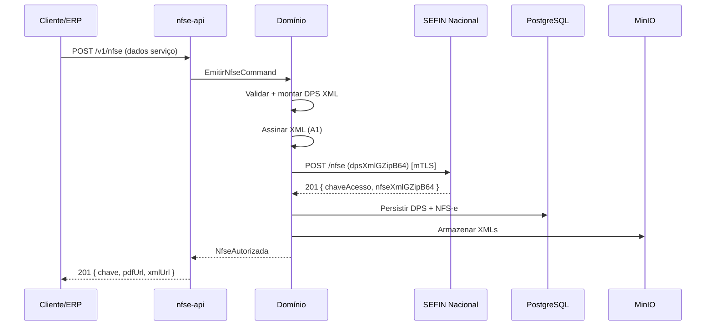
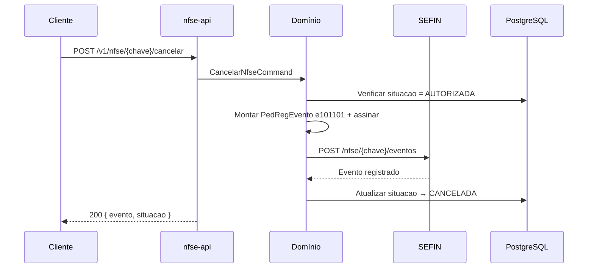
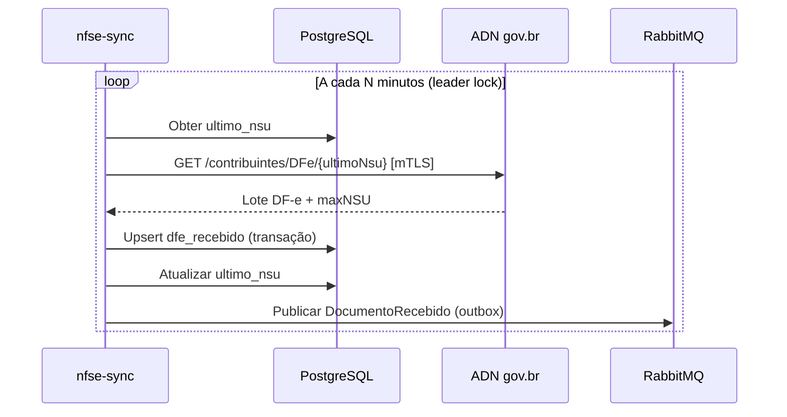

# Projeto: Sistema NFS-e Nacional — Emissor Integrado (Docker)

> **Escopo:** integração completa com o [Sistema Nacional de NFS-e](https://www.gov.br/nfse/pt-br/biblioteca/documentacao-tecnica) para **um único CNPJ** e **certificado digital A1 (e-CNPJ ICP-Brasil)**.  
> **Objetivo deste documento:** especificação arquitetural e de engenharia — **sem código** — pronta para orientar implementação, homologação e evolução.

---

## Sumário

1. [Visão geral](#1-visão-geral)
2. [Documentação oficial de referência](#2-documentação-oficial-de-referência)
3. [Premissas e restrições](#3-premissas-e-restrições)
4. [Operações fiscais suportadas](#4-operações-fiscais-suportadas)
5. [Arquitetura de alto nível](#5-arquitetura-de-alto-nível)
6. [Padrões de projeto e engenharia](#6-padrões-de-projeto-e-engenharia)
7. [Componentes Docker (topologia)](#7-componentes-docker-topologia)
8. [Estrutura de diretórios do repositório](#8-estrutura-de-diretórios-do-repositório)
9. [Camadas e responsabilidades](#9-camadas-e-responsabilidades)
10. [Integração com APIs governamentais](#10-integração-com-apis-governamentais)
11. [Certificado digital A1 e segurança](#11-certificado-digital-a1-e-segurança)
12. [Modelo de dados e persistência](#12-modelo-de-dados-e-persistência)
13. [Fluxos operacionais principais](#13-fluxos-operacionais-principais)
14. [Geração do DANFSe (pós jul/2026)](#14-geração-do-danfse-pós-jul2026)
15. [Observabilidade, resiliência e filas](#15-observabilidade-resiliência-e-filas)
16. [API interna do sistema (contrato)](#16-api-interna-do-sistema-contrato)
17. [Ambientes e configuração](#17-ambientes-e-configuração)
18. [Testes e homologação](#18-testes-e-homologação)
19. [Roadmap de implementação](#19-roadmap-de-implementação)
20. [Riscos e mitigações](#20-riscos-e-mitigações)
21. [Anexos](#21-anexos)

---

## 1. Visão geral

### 1.1 Problema

Empresas prestadoras de serviço precisam emitir, consultar, cancelar, substituir e acompanhar NFS-e conforme o **Padrão Nacional**, integrando-se à **SEFIN Nacional** (autorização) e ao **ADN** (Ambiente de Dados Nacional — distribuição e consulta), com autenticação **mTLS** via certificado **A1 e-CNPJ**.

### 1.2 Solução proposta

Sistema **containerizado (Docker Compose / Kubernetes-ready)** composto por serviços desacoplados que:

- Expõe uma **API REST interna** estável para sistemas externos (ERP, CRM, automações).
- Orquestra o ciclo de vida fiscal completo da NFS-e (DPS → NFS-e → Eventos → DANFSe).
- Centraliza **assinatura XML**, **compactação GZip+Base64**, **mTLS** e **auditoria**.
- Mantém **repositório local** sincronizado com o ADN (NSU).
- Opera exclusivamente com **1 CNPJ + 1 certificado A1** (sem multi-tenant).

### 1.3 Princípios arquiteturais

| Princípio | Aplicação |
|-----------|-----------|
| **Separation of Concerns** | Domínio fiscal isolado de HTTP, persistência e infra gov.br |
| **Hexagonal (Ports & Adapters)** | Portas para SEFIN, ADN, certificado, banco, fila |
| **Domain-Driven Design (DDD)** | Agregados: DPS, NFS-e, Evento, LoteDFe |
| **CQRS leve** | Comandos (emitir/cancelar) vs consultas (listar/histórico) |
| **Event Sourcing parcial** | Histórico imutável de transições de status |
| **Idempotência** | Chave idempotente por `idDps` / `correlationId` |
| **Fail-safe + retry** | Circuit breaker, backoff exponencial, DLQ |
| **12-Factor App** | Config via env, logs stdout, stateless nos workers |

---

## 2. Documentação oficial de referência

Portal central: [Documentação técnica — Portal NFS-e](https://www.gov.br/nfse/pt-br/biblioteca/documentacao-tecnica)

| Seção do portal | Uso no projeto |
|-----------------|----------------|
| [Documentação Atual (Produção)](https://www.gov.br/nfse/pt-br/biblioteca/documentacao-tecnica/documentacao-atual) | Manual integrado, leiautes XSD, regras de negócio |
| [Documentação Técnica (Homologação/testes)](https://www.gov.br/nfse/pt-br/biblioteca/documentacao-tecnica/documentacao-tecnica-homologacao-testes) | Ambiente Produção Restrita |
| [APIs - Prod. Restrita e Produção](https://www.gov.br/nfse/pt-br/biblioteca/documentacao-tecnica/apis-prod-restrita-e-producao) | Swagger OpenAPI oficial |
| [RTC](https://www.gov.br/nfse/pt-br/biblioteca/documentacao-tecnica/rtc) | Reforma Tributária (IBS/CBS) |
| [Atualizações e Implantações](https://www.gov.br/nfse/pt-br/biblioteca/documentacao-tecnica/atualizacoes-e-implantacoes) | Changelog normativo |

### Manuais essenciais (download via portal)

- **Manual Integrado do Sistema Nacional NFS-e** — visão geral, APIs, certificados, leiautes.
- **Manual dos Contribuintes — Emissor Público API** — emissão, consulta, eventos (contribuinte).
- **Guia das APIs do ADN** — distribuição DF-e, DANFSe, NSU.
- **Anexo II — Leiautes e Regras de Negócio (Eventos)** — códigos de evento, validações.
- **Esquemas XSD** — DPS, NFS-e, PedRegEvento, Evento (versionados).

### Swagger / OpenAPI (consultar no portal)

- SEFIN Nacional — Contribuintes
- ADN — Contribuintes (DF-e, DANFSe)
- Parâmetros Municipais

> **Regra de ouro:** toda implementação deve rastrear versão de manual/XSD utilizada. Atualizações normativas entram via pipeline de validação de schemas.

---

## 3. Premissas e restrições

### 3.1 Escopo funcional

- **1 CNPJ prestador** (inscrição federal fixa em configuração).
- **1 certificado A1 e-CNPJ** (ICP-Brasil, OID CNPJ `2.16.76.1.3.3`, EKU Client Auth).
- Município de emissão via **SEFIN Nacional** (contribuinte conveniado ao padrão nacional).
- Sem OAuth/token gov.br — autenticação exclusivamente **mTLS**.

### 3.2 Fora de escopo inicial (extensível)

- Multi-CNPJ / multi-certificado (arquitetura preparada, não habilitada).
- Emissão municipal legado ABRASF 2.03 (adapter futuro).
- Painel Administrativo Municipal.
- Módulo de Apuração Nacional (MAN) — apenas leitura de parametrização.

### 3.3 Requisitos não-funcionais

| Requisito | Meta |
|-----------|------|
| Disponibilidade API interna | 99,5% |
| Emissão síncrona (happy path) | < 15s P95 |
| Retenção XML/auditoria | 5 anos (mínimo legal) |
| RTO (recuperação) | < 4h |
| RPO (perda de dados) | < 5 min |

---

## 4. Operações fiscais suportadas

### 4.1 SEFIN Nacional — Emissor (contribuinte)

| Operação | Método gov.br | Descrição | Prioridade |
|----------|---------------|-----------|------------|
| **Emitir NFS-e** | `POST /nfse` | Envia DPS assinada (XML GZip+B64) → retorna NFS-e autorizada | P0 |
| **Substituir NFS-e** | `POST /nfse` | DPS com referência à NFS-e substituída → cancelamento por substituição + nova nota | P0 |
| **Consultar NFS-e** | `GET /nfse/{chaveAcesso}` | Recupera XML da NFS-e (50 posições) | P0 |
| **Consultar DPS → chave** | `GET /dps/{id}` | Obtém chave de acesso a partir do identificador da DPS | P0 |
| **Verificar DPS emitida** | `HEAD /dps/{id}` | Confirma existência sem expor chave (sigilo) | P1 |
| **Registrar evento** | `POST /nfse/{chaveAcesso}/eventos` | Cancelamento, manifestação, solicitação análise fiscal | P0 |
| **Listar eventos** | `GET /nfse/{chaveAcesso}/eventos` | Histórico completo | P0 |
| **Consultar evento** | `GET /nfse/{chaveAcesso}/eventos/{tipo}/{seq}` | Evento específico | P1 |

### 4.2 Eventos implementados (contribuinte emissor)

| Código | Evento | Efeito |
|--------|--------|--------|
| `e101101` | Cancelamento de NFS-e | Cancela a nota |
| `e105102` | Cancelamento por Substituição | Automático na substituição |
| `e101103` | Solicitação Análise Fiscal p/ Cancelamento | Inicia fluxo fiscal |
| Manifestações | Confirmação/Rejeição (prestador, tomador, intermediário) | Ciência, sem cancelar |

> Eventos de ofício, bloqueio/desbloqueio e análise fiscal **deferida/indeferida** são emitidos pelo município — o sistema **consome** via ADN/consulta.

### 4.3 ADN — Distribuição e documentos auxiliares

| Operação | Método gov.br | Descrição | Prioridade |
|----------|---------------|-----------|------------|
| **Sincronizar DF-e** | `GET /contribuintes/DFe/{UltimoNSU}` | Pull incremental de NFS-e/eventos recebidos | P0 |
| **Consultar NSU** | `GET /contribuintes/DFe/{NSU}` | Recuperação pontual | P1 |
| **Listar eventos (ADN)** | `GET /contribuintes/NFSe/{chave}/Eventos` | Visão distribuída | P1 |
| **Baixar DANFSe** | `GET /danfse/{chaveAcesso}` | PDF auxiliar (ver §14 — transição 2026) | P2 |

### 4.4 Parametrização municipal (pré-emissão)

| Operação | Método | Uso |
|----------|--------|-----|
| Convênio | `GET /parametros_municipais/{cMun}/convenio` | Valida adesão do município |
| Alíquotas | `GET /parametros_municipais/{cMun}/aliquotas` | Cálculo ISS |
| Regimes especiais | `GET /parametros_municipais/{cMun}/regimes_especiais` | Tributação |
| Retenções | `GET /parametros_municipais/{cMun}/retencoes` | Retenções federais/municipais |
| Benefícios | `GET /parametros_municipais/{cMun}/beneficiomunicipal/{nBM}` | Incentivos |

### 4.5 Cadastro Nacional de Contribuintes (CNC)

| Operação | Descrição |
|----------|-----------|
| Verificação cadastral | Validar habilitação do CNPJ antes da emissão |
| Sincronização | Consultar situação no CNC/RFB conforme manual |

---

## 5. Arquitetura de alto nível

```
┌─────────────────────────────────────────────────────────────────────────────┐
│                         CLIENTES EXTERNOS                                    │
│              (ERP, CRM, scripts, portal interno, webhooks)                   │
└──────────────────────────────────┬──────────────────────────────────────────┘
                                   │ HTTPS + API Key / JWT interno
                                   ▼
┌─────────────────────────────────────────────────────────────────────────────┐
│  API GATEWAY (Traefik / Kong)                                                │
│  • Rate limit • TLS termination • Routing • CORS                             │
└──────────────────────────────────┬──────────────────────────────────────────┘
                                   │
          ┌────────────────────────┼────────────────────────┐
          ▼                        ▼                        ▼
┌──────────────────┐   ┌──────────────────┐   ┌──────────────────┐
│  nfse-api        │   │  nfse-worker     │   │  nfse-sync       │
│  (REST BFF)      │   │  (async jobs)    │   │  (ADN NSU poll)  │
└────────┬─────────┘   └────────┬─────────┘   └────────┬─────────┘
         │                      │                      │
         └──────────────────────┼──────────────────────┘
                                ▼
┌─────────────────────────────────────────────────────────────────────────────┐
│                    CAMADA DE DOMÍNIO (shared lib / package)                  │
│  DPS Builder │ XML Signer │ Schema Validator │ Event Factory │ State Machine │
└──────────────────────────────────┬──────────────────────────────────────────┘
                                   │
         ┌─────────────────────────┼─────────────────────────┐
         ▼                         ▼                         ▼
┌─────────────────┐    ┌─────────────────┐    ┌─────────────────┐
│ nfse-gov-client │    │ nfse-cert-vault │    │ nfse-danfse     │
│ SEFIN + ADN     │    │ A1 loader/mTLS  │    │ PDF generator   │
│ (adapters)      │    │                 │    │ (local v2.0)    │
└────────┬────────┘    └────────┬────────┘    └─────────────────┘
         │ mTLS                 │ PKCS#12
         ▼                      ▼
┌─────────────────────────────────────────────────────────────────────────────┐
│              GOVERNO — SEFIN Nacional + ADN (gov.br)                         │
│  sefin.nfse.gov.br / sefin.producaorestrita.nfse.gov.br                     │
│  adn.nfse.gov.br / adn.producaorestrita.nfse.gov.br                         │
└─────────────────────────────────────────────────────────────────────────────┘

         ┌──────────────────────────────────────────────────────────┐
         │  INFRAESTRUTURA COMPARTILHADA (Docker network)            │
         │  PostgreSQL │ Redis │ RabbitMQ │ MinIO │ Prometheus/Grafana │
         └──────────────────────────────────────────────────────────┘
```

### 5.1 Bounded Contexts (DDD)

| Contexto | Responsabilidade |
|----------|------------------|
| **Emissão** | Construção DPS, numeração, substituição |
| **Autorização** | Comunicação SEFIN, parsing de retorno |
| **Eventos** | Cancelamento, manifestações, pedidos |
| **Distribuição** | Sincronismo ADN/NSU, documentos recebidos |
| **Documentação** | DANFSe, armazenamento PDF/XML |
| **Parametrização** | Cache de regras municipais |
| **Identidade Fiscal** | CNPJ, certificado, credenciais mTLS |

---

## 6. Padrões de projeto e engenharia

### 6.1 Estrutural

| Padrão | Onde |
|--------|------|
| **Adapter** | `SefinAdapter`, `AdnAdapter` — isolam APIs gov.br |
| **Facade** | `NfseService` — orquestra emitir/consultar/cancelar |
| **Strategy** | Assinatura XML (XMLDSig enveloped), compactação payload |
| **Factory** | `EventoFactory`, `DpsFactory` por tipo de operação |
| **Repository** | Persistência DPS/NFS-e/Evento/NSU |
| **Unit of Work** | Transação ao persistir emissão + XML + audit log |

### 6.2 Comportamental

| Padrão | Onde |
|--------|------|
| **State Machine** | Ciclo de vida: `RASCUNHO → ENVIANDO → AUTORIZADA → CANCELADA → SUBSTITUIDA` |
| **Command** | `EmitirNfseCommand`, `CancelarNfseCommand` |
| **Observer / Domain Events** | `NfseAutorizada`, `NfseCancelada` → webhooks, sync |
| **Retry + Circuit Breaker** | Chamadas gov.br (Resilience4j / Polly equivalente) |
| **Outbox** | Garantir publicação de eventos após commit DB |
| **Saga (coreografia)** | Substituição: cancelamento implícito + nova emissão |

### 6.3 Integração

| Padrão | Onde |
|--------|------|
| **Anti-Corruption Layer (ACL)** | Traduz JSON gov.br ↔ modelos de domínio |
| **Gateway** | `nfse-gov-client` único ponto mTLS |
| **Idempotency Key** | Header `X-Idempotency-Key` na API interna |

---

## 7. Componentes Docker (topologia)

### 7.1 Serviços de aplicação

| Container | Imagem base | Função | Réplicas |
|-----------|-------------|--------|----------|
| `nfse-api` | Node 22 / Python 3.12 / Go 1.22 | API REST interna, validação entrada, orquestração síncrona | 1–2 |
| `nfse-worker` | mesma stack | Jobs assíncronos: retry emissão, outbox, webhooks | 1–3 |
| `nfse-sync` | mesma stack | Polling ADN NSU (cron 1–5 min) | 1 |
| `nfse-cert-vault` | sidecar ou lib | Carrega PFX, expõe mTLS agent local (opcional sidecar) | 1 |
| `nfse-danfse` | Node/Java | Renderização DANFSe v2.0 local | 1 |
| `nfse-gateway` | Traefik 3.x | Reverse proxy, TLS, rate limit | 1 |

### 7.2 Infraestrutura

| Container | Função | Volume persistente |
|-----------|--------|-------------------|
| `postgres` | Dados transacionais + audit | `pgdata` |
| `redis` | Cache parametrização, idempotência, locks | `redisdata` |
| `rabbitmq` | Filas: emissão, sync, webhook, DLQ | `mqdata` |
| `minio` | Object storage: XML, PDF, PFX backup criptografado | `miniodata` |
| `prometheus` | Métricas | `promdata` |
| `grafana` | Dashboards | `grafanadata` |
| `loki` + `promtail` | Logs centralizados | `lokidata` |
| `vault` *(opcional)* | Secrets (senha PFX, API keys) | `vaultdata` |

### 7.3 Redes Docker

```yaml
networks:
  nfse-public:    # gateway ↔ clientes
  nfse-app:       # api, worker, sync, danfse
  nfse-data:      # postgres, redis, rabbitmq, minio
  nfse-obs:       # prometheus, grafana, loki
  nfse-egress:    # apenas nfse-gov-client → internet (gov.br)
```

### 7.4 docker-compose (visão de profiles)

| Profile | Uso |
|---------|-----|
| `dev` | Hot reload, mocks gov.br, Mailhog |
| `homolog` | Produção Restrita gov.br |
| `prod` | Produção, Vault, backups automáticos |

### 7.5 Escalabilidade horizontal

- **Stateless:** `nfse-api`, `nfse-worker` — escalar réplicas; sticky sessions **não** necessárias.
- **Singleton:** `nfse-sync` — leader election via Redis lock (Redlock) para evitar NSU duplicado.
- **Kubernetes (fase 2):** Helm chart com HPA em `nfse-api`/`nfse-worker`, CronJob para sync fallback.

---

## 8. Estrutura de diretórios do repositório

```
nfse-nacional/
├── README.md
├── PROJETO-NFSE-NACIONAL.md          # este documento
├── docker-compose.yml
├── docker-compose.override.yml
├── docker-compose.prod.yml
├── .env.example
│
├── docs/
│   ├── adr/                          # Architecture Decision Records
│   │   ├── 001-hexagonal-architecture.md
│   │   ├── 002-single-cnpj-cert.md
│   │   └── 003-danfse-local-generation.md
│   ├── runbooks/
│   │   ├── certificado-renovacao.md
│   │   ├── sync-nsu-troubleshooting.md
│   │   └── rollback-deploy.md
│   ├── gov/                          # PDFs/XSD espelhados (git-lfs)
│   │   └── schemas/
│   └── openapi/
│       ├── internal-api.yaml         # API do sistema
│       └── gov-sefin.snapshot.yaml   # snapshot swagger gov
│
├── infra/
│   ├── docker/
│   │   ├── nfse-api/Dockerfile
│   │   ├── nfse-worker/Dockerfile
│   │   ├── nfse-sync/Dockerfile
│   │   └── nfse-danfse/Dockerfile
│   ├── traefik/
│   │   ├── traefik.yml
│   │   └── dynamic/
│   ├── postgres/init/
│   ├── prometheus/
│   ├── grafana/dashboards/
│   └── k8s/                          # manifests futuros
│       └── helm/nfse-nacional/
│
├── packages/                         # monorepo (opcional)
│   ├── nfse-domain/                  # entidades, VOs, regras puras
│   ├── nfse-application/             # use cases / commands
│   ├── nfse-gov-client/              # adapters SEFIN + ADN
│   ├── nfse-xml/                     # build, sign, validate XSD
│   └── nfse-shared/                  # utils, errors, telemetry
│
├── services/
│   ├── nfse-api/
│   │   └── src/
│   │       ├── main.*
│   │       ├── routes/
│   │       ├── middleware/
│   │       └── di/                   # injeção de dependências
│   ├── nfse-worker/
│   ├── nfse-sync/
│   └── nfse-danfse/
│
├── migrations/                       # Flyway / Alembic / Prisma
│   └── V001__initial_schema.sql
│
├── scripts/
│   ├── import-xsd.sh
│   ├── rotate-cert.sh
│   └── seed-homolog.sh
│
└── tests/
    ├── unit/
    ├── integration/                  # testcontainers
    ├── e2e/                          # homolog gov.br
    └── fixtures/                     # XMLs de exemplo anonimizados
```

---

## 9. Camadas e responsabilidades

### 9.1 Domain (`packages/nfse-domain`)

**Entidades e agregados:**

- `Dps` — identificador (cMun + tipoInsc + inscFederal + serie + nDPS), status, XML assinado.
- `Nfse` — chaveAcesso (50), idDps, xmlAutorizado, situacao, tomador, valores.
- `EventoNfse` — tipo (e101101…), sequencial, xmlEvento, pedidoRegistro.
- `DocumentoFiscalRecebido` — NSU, tipo DF-e, chave, xml, dataRecebimento.
- `ParametrosMunicipais` — cache por codigoIBGE + TTL.

**Value Objects:**

- `ChaveAcesso`, `Cnpj`, `CodigoServicoLc116`, `Dinheiro`, `Endereco`, `IdentificadorDps`.

**Serviços de domínio:**

- `CalculadoraIss`, `GeradorIdDps`, `ValidadorRegrasNegocio` (pré-envio).

### 9.2 Application (`packages/nfse-application`)

**Use cases (commands):**

| Use Case | Input | Output |
|----------|-------|--------|
| `EmitirNfse` | dados serviço, tomador, valores | NFS-e autorizada ou erros |
| `SubstituirNfse` | chaveSubstituida + nova DPS | NFS-e substituta |
| `CancelarNfse` | chaveAcesso, codigoMotivo, motivo | evento cancelamento |
| `ManifestarNfse` | chave, tipo manifestação | evento |
| `ConsultarNfse` | chave ou idDps | NFS-e + eventos |
| `SincronizarDfe` | ultimoNsu | lote documentos |
| `GerarDanfse` | chaveAcesso | PDF bytes |
| `AtualizarParametrosMunicipais` | codigoIBGE | cache refresh |

### 9.3 Infrastructure (`packages/nfse-gov-client`)

**Portas (interfaces):**

```text
ISefinGateway
  - emitir(dpsXml) → ResultadoEmissao
  - consultarNfse(chave) → NfseXml
  - consultarDps(id) → ChaveAcesso | null
  - registrarEvento(chave, pedidoXml) → ResultadoEvento
  - listarEventos(chave) → Evento[]

IAdnGateway
  - sincronizarDfe(ultimoNsu) → LoteDfe
  - baixarDanfse(chave) → bytes | null
  - listarEventosNfse(chave) → Evento[]

ICertificadoProvider
  - getSslContext() → mTLS context
  - assinarXml(xml, elemento) → xmlAssinado
  - validade() → Date, avisoExpiracao

IParametrosMunicipaisGateway
  - obterAliquotas(cMun), obterConvenio(cMun), ...
```

### 9.4 API (`services/nfse-api`)

- Validação de DTO (OpenAPI).
- Autenticação interna (API Key ou JWT HS256).
- Mapeamento HTTP → Commands.
- Respostas padronizadas RFC 7807 (Problem Details).

---

## 10. Integração com APIs governamentais

### 10.1 Endpoints base

| Ambiente | SEFIN Nacional | ADN |
|----------|----------------|-----|
| **Produção Restrita** | `https://sefin.producaorestrita.nfse.gov.br/SefinNacional` | `https://adn.producaorestrita.nfse.gov.br` |
| **Produção** | `https://sefin.nfse.gov.br/SefinNacional` | `https://adn.nfse.gov.br` |

> Alguns municípios usam URL própria mantendo layout nacional — prever `EndpointOverride` por código IBGE no adapter.

### 10.2 Protocolo de comunicação

| Aspecto | Especificação |
|---------|---------------|
| Transporte | HTTPS TLS 1.2+ |
| Autenticação | mTLS — certificado cliente A1 |
| Request/Response envelope | JSON |
| Conteúdo fiscal | XML assinado (XMLDSig enveloped) |
| Compactação | GZip + Base64 nos campos `*XmlGZipB64` |
| Encoding | UTF-8 |
| Processamento emissão/eventos | **Síncrono** (mesma conexão) |

### 10.3 Exemplo de fluxo de payload (emissão)

```text
1. Montar XML DPS conforme XSD vigente
2. Validar contra XSD + regras de negócio locais
3. Assinar XML (certificado A1 do CNPJ)
4. GZip → Base64 → { "dpsXmlGZipB64": "..." }
5. POST /nfse com mTLS
6. Resposta 201: { chaveAcesso, idDps, nfseXmlGZipB64, alertas[] }
7. Persistir + publicar NfseAutorizada
```

### 10.4 Tratamento de erros gov.br

| HTTP | Ação do sistema |
|------|-----------------|
| 400 | Mapear `erros[].Codigo/Descricao` → erro de negócio (não retry) |
| 403 | Certificado/CNPJ inválido → alerta crítico |
| 404 | Documento inexistente |
| 409 / duplicidade DPS | Retornar NFS-e existente (idempotência) |
| 429 / 503 | Retry com backoff + jitter |
| 500 | Retry limitado → DLQ + notificação |

### 10.5 Identificador da DPS (id)

Composição (43 caracteres):

```text
{cMun 7}{tipoInsc 1}{inscFederal 14}{serie 5}{nDPS 15}
```

Usado para idempotência e consulta `GET/HEAD /dps/{id}`.

### 10.6 Chave de acesso NFS-e

- **50 caracteres** — formato próprio nacional (diferente NF-e).
- Armazenar como PK alternativa em consultas externas.

---

## 11. Certificado digital A1 e segurança

### 11.1 Requisitos ICP-Brasil

| Requisito | Detalhe |
|-----------|---------|
| Tipo | A1 (arquivo `.pfx` / PKCS#12) |
| Titular | e-CNPJ com OID `2.16.76.1.3.3` |
| EKU | Client Authentication (mTLS) |
| Uso transmissão | mTLS em todas as chamadas SEFIN/ADN |
| Uso assinatura | XMLDSig em DPS e PedRegEvento |

### 11.2 Gestão do certificado no Docker

```text
┌─────────────────────────────────────────┐
│  Volume criptografado (Docker secret)    │
│  /run/secrets/certificado.pfx           │
│  /run/secrets/certificado.senha         │
└──────────────────┬──────────────────────┘
                   │ read-only, memória
                   ▼
         nfse-cert-vault (init container)
                   │
                   ├── Valida validade (alerta 30/15/7 dias)
                   ├── Extrai cadeia ICP-Brasil
                   └── Provisiona SSL context para gov-client
```

**Boas práticas:**

- Nunca commitar PFX no repositório.
- Rotação documentada em runbook; suportar 2 versões durante transição.
- Backup do PFX em cofre (Vault / AWS Secrets Manager).
- Permissões `0400` no secret montado.

### 11.3 Segurança da API interna

| Camada | Medida |
|--------|--------|
| Rede | API não exposta publicamente; apenas VPN/rede interna |
| Auth | API Key rotacionável ou JWT curto (15 min) |
| Input | Sanitização, limites de payload, rate limit 100 req/min |
| Audit | Log imutável: quem, quando, operação, chave, IP |
| LGPD | Mascaramento CPF/CNPJ tomador em logs |

---

## 12. Modelo de dados e persistência

### 12.1 Diagrama ER (simplificado)

```text
┌─────────────┐     1:1      ┌─────────────┐
│    dps      │─────────────▶│    nfse     │
├─────────────┤              ├─────────────┤
│ id (uuid)   │              │ chave_50 PK │
│ id_dps      │              │ xml_gzip    │
│ status      │              │ situacao    │
│ xml_dps     │              │ emitida_em  │
│ correlation │              └──────┬──────┘
└─────────────┘                     │ 1:N
                                    ▼
                             ┌─────────────┐
                             │   evento    │
                             ├─────────────┤
                             │ tipo_evento │
                             │ seq         │
                             │ xml_evento  │
                             └─────────────┘

┌─────────────┐     ┌─────────────┐     ┌─────────────┐
│ dfe_nsu     │     │ audit_log   │     │ parametros  │
│ controle    │     │ (append)    │     │ _municipio  │
└─────────────┘     └─────────────┘     └─────────────┘
```

### 12.2 Tabelas principais

| Tabela | Campos críticos |
|--------|-----------------|
| `dps` | `id_dps` UNIQUE, `status`, `payload_hash`, `xml_storage_key` |
| `nfse` | `chave_acesso` UNIQUE, `id_dps` FK, `situacao`, `valor_servico` |
| `evento` | `chave_acesso` FK, `tipo`, `num_seq`, `status_registro` |
| `dfe_recebido` | `nsu` UNIQUE, `tipo_dfe`, `chave`, `processado` |
| `nsu_controle` | `ultimo_nsu`, `updated_at` |
| `idempotency` | `key`, `response`, `expires_at` |
| `outbox` | `event_type`, `payload`, `published` |
| `audit_log` | `action`, `entity`, `entity_id`, `metadata` JSONB |

### 12.3 Object Storage (MinIO)

```text
bucket: nfse-xml
  /{ano}/{mes}/{chave_acesso}/nfse.xml
  /{ano}/{mes}/{chave_acesso}/dps.xml
  /{ano}/{mes}/{chave_acesso}/eventos/{tipo}_{seq}.xml
  /danfse/{chave_acesso}.pdf
```

---

## 13. Fluxos operacionais principais

### 13.1 Emissão síncrona (happy path)



### 13.2 Cancelamento



### 13.3 Substituição

```text
1. Cliente informa chaveAcesso da NFS-e a substituir
2. Nova DPS inclui referência (chSubstda / campos XSD)
3. POST /nfse → SEFIN gera:
   a) Evento e105102 (cancelamento por substituição) na nota original
   b) Nova NFS-e substituta
4. Persistir vínculo substituída ↔ substituta
5. Atualizar state machine de ambas
```

### 13.4 Sincronização ADN (background)



### 13.5 Consulta unificada

A API interna agrega:

1. Dados locais (PostgreSQL + MinIO).
2. Refresh opcional na SEFIN (`GET /nfse/{chave}`) se stale > TTL.
3. Eventos locais + ADN.

---

## 14. Geração do DANFSe (pós jul/2026)

Conforme **Nota Técnica 008/2026**, a API gov.br de DANFSe será **descontinuada** (01/07/2026). O sistema deve:

| Capacidade | Abordagem |
|------------|-----------|
| PDF auxiliar | Serviço `nfse-danfse` gera localmente padrão **v2.0** |
| QR Code | URL consulta pública conforme NT |
| Campos IBS/CBS | Mapear do XML NFS-e (RTC) |
| Cancelada/Substituída | Marca d'água obrigatória |
| Fallback temporário | `GET /danfse/{chave}` no ADN enquanto disponível |

---

## 15. Observabilidade, resiliência e filas

### 15.1 Métricas (Prometheus)

| Métrica | Tipo |
|---------|------|
| `nfse_emissao_total{status}` | Counter |
| `nfse_emissao_duration_seconds` | Histogram |
| `nfse_gov_errors_total{api,codigo}` | Counter |
| `nfse_cert_dias_para_expirar` | Gauge |
| `nfse_sync_nsu_lag` | Gauge |
| `nfse_outbox_pending` | Gauge |

### 15.2 Logs estruturados (JSON)

```json
{
  "level": "info",
  "service": "nfse-api",
  "trace_id": "...",
  "operation": "emitir_nfse",
  "id_dps": "...",
  "chave_acesso": "...",
  "duration_ms": 1234,
  "gov_codigo": null
}
```

### 15.3 Filas RabbitMQ

| Fila | Consumidor | Propósito |
|------|------------|-----------|
| `nfse.emissao.retry` | worker | Retry emissão falha transitória |
| `nfse.webhook.dispatch` | worker | Notificar ERP |
| `nfse.sync.process` | worker | Processar DF-e recebido |
| `nfse.dlq` | — | Dead letter manual review |

### 15.4 Circuit Breaker (gov.br)

```text
Estados: CLOSED → OPEN (5 falhas/60s) → HALF_OPEN (probe)
Timeout conexão: 10s | read: 60s (emissão síncrona)
```

### 15.5 Health checks

| Endpoint | Verifica |
|----------|----------|
| `GET /health/live` | Processo up |
| `GET /health/ready` | DB, Redis, certificado válido |
| `GET /health/gov` | Opcional — ping HEAD SEFIN (rate limited) |

---

## 16. API interna do sistema (contrato)

> Contrato estável para acoplamento de ERPs — gov.br fica encapsulado.

### 16.1 Endpoints propostos

| Método | Rota | Descrição |
|--------|------|-----------|
| `POST` | `/v1/nfse` | Emitir NFS-e |
| `POST` | `/v1/nfse/{chave}/cancelar` | Cancelar |
| `POST` | `/v1/nfse/{chave}/substituir` | Substituir |
| `GET` | `/v1/nfse/{chave}` | Consultar NFS-e |
| `GET` | `/v1/nfse` | Listar com filtros (data, tomador, status) |
| `GET` | `/v1/nfse/{chave}/eventos` | Eventos da nota |
| `GET` | `/v1/nfse/{chave}/danfse` | Download PDF |
| `GET` | `/v1/nfse/{chave}/xml` | Download XML |
| `GET` | `/v1/dps/{id}` | Status DPS / chave |
| `POST` | `/v1/sync/dfe` | Forçar sincronização ADN |
| `GET` | `/v1/parametros/municipio/{ibge}` | Parametrização cacheada |
| `GET` | `/v1/health/*` | Health checks |

### 16.2 Headers padrão

| Header | Uso |
|--------|-----|
| `Authorization` | Bearer JWT ou `X-API-Key` |
| `X-Idempotency-Key` | UUID — obrigatório em POST emitir |
| `X-Correlation-Id` | Rastreamento ponta a ponta |

### 16.3 Webhooks (opcional)

Eventos: `nfse.autorizada`, `nfse.cancelada`, `nfse.substituida`, `nfse.rejeitada`, `dfe.recebido`.

Retry: 3 tentativas exponential backoff; assinatura HMAC-SHA256.

---

## 17. Ambientes e configuração

### 17.1 Variáveis de ambiente principais

| Variável | Exemplo | Descrição |
|----------|---------|-----------|
| `NFSE_AMBIENTE` | `homolog` \| `prod` | Seleciona URLs gov.br |
| `NFSE_CNPJ` | `12345678000199` | CNPJ prestador |
| `NFSE_CERT_PATH` | `/run/secrets/cert.pfx` | Caminho certificado |
| `NFSE_CERT_PASSWORD` | *(secret)* | Senha PFX |
| `NFSE_C_MUN_EMISSOR` | `3550308` | IBGE município emissor |
| `NFSE_DPS_SERIE` | `00001` | Série DPS |
| `DATABASE_URL` | `postgresql://...` | Postgres |
| `REDIS_URL` | `redis://...` | Cache |
| `RABBITMQ_URL` | `amqp://...` | Filas |
| `MINIO_*` | — | Object storage |
| `NFSE_SYNC_INTERVAL_SEC` | `300` | Intervalo poll ADN |

### 17.2 Matriz de ambientes

| Aspecto | Dev | Homolog (Prod. Restrita) | Produção |
|---------|-----|--------------------------|----------|
| gov.br | Mock / WireMock | Produção Restrita | Produção |
| Certificado | Autoridade teste | A1 real homolog | A1 produção |
| Dados | Seed fake | Notas teste | Reais |
| Observabilidade | Debug verbose | Completa | Completa + alertas |

---

## 18. Testes e homologação

### 18.1 Pirâmide de testes

| Nível | Escopo | Ferramentas |
|-------|--------|-------------|
| Unitário | Domínio, validadores, state machine | Jest/Pytest/Go test |
| Integração | DB, Redis, filas | Testcontainers |
| Contrato | XSD validation, snapshots XML | xmllint, oficiais XSD |
| E2E | Prod. Restrita gov.br | Pipeline manual/aprovado |
| Carga | 50 emissões/min sustained | k6 / Locust |

### 18.2 Casos de teste obrigatórios (homolog gov.br)

- [ ] Emissão NFS-e simples — tomador PF e PJ
- [ ] Emissão com retenções federais
- [ ] Rejeição por regra de negócio (código erro mapeado)
- [ ] Idempotência — reenvio mesmo `idDps`
- [ ] Cancelamento e101101
- [ ] Substituição com vínculo chSubstda
- [ ] Consulta GET /nfse e GET /dps
- [ ] Sincronização ADN NSU — 100+ documentos
- [ ] Certificado expirado → erro 403 claro
- [ ] DANFSe local conforme NT 008/2026

---

## 19. Roadmap de implementação

### Fase 0 — Fundação (2 semanas)

- [ ] Repositório monorepo + Docker Compose base
- [ ] ADRs iniciais
- [ ] Import XSD gov.br + pipeline validação
- [ ] PostgreSQL migrations v1
- [ ] nfse-cert-vault + mTLS smoke test homolog

### Fase 1 — Emissão MVP (3 semanas)

- [ ] Domínio DPS + assinatura XMLDSig
- [ ] Adapter SEFIN POST /nfse
- [ ] API POST /v1/nfse
- [ ] Persistência + MinIO
- [ ] Testes E2E emissão homolog

### Fase 2 — Consultas e ciclo de vida (2 semanas)

- [ ] GET /nfse, GET /dps, HEAD /dps
- [ ] Cancelamento e101101
- [ ] State machine + audit log
- [ ] API consultas internas

### Fase 3 — Substituição e eventos (2 semanas)

- [ ] Substituição via DPS
- [ ] Listagem/consulta eventos
- [ ] Manifestações (se aplicável ao CNPJ)

### Fase 4 — ADN e sync (2 semanas)

- [ ] nfse-sync NSU polling
- [ ] Processamento DF-e recebidos
- [ ] Webhooks

### Fase 5 — DANFSe e produção (2 semanas)

- [ ] nfse-danfse local v2.0
- [ ] Observabilidade completa
- [ ] Runbooks + backup/restore
- [ ] Go-live produção

### Fase 6 — Evolução (contínuo)

- [ ] RTC IBS/CBS — campos reforma
- [ ] Adapter municípios URL customizada
- [ ] Helm chart Kubernetes
- [ ] Portal web interno (opcional)

---

## 20. Riscos e mitigações

| Risco | Impacto | Mitigação |
|-------|---------|-----------|
| Mudança XSD/manual gov.br | Quebra emissão | Versionamento schemas, CI validação, monitorar [Atualizações](https://www.gov.br/nfse/pt-br/biblioteca/documentacao-tecnica/atualizacoes-e-implantacoes) |
| Expiração certificado A1 | Parada total | Alertas 30/15/7 dias, runbook renovação |
| Indisponibilidade SEFIN | Emissão bloqueada | Retry + fila + status degraded |
| Duplicidade DPS | Nota duplicada | id_dps UNIQUE + idempotency key |
| Descontinuação API DANFSe | Sem PDF | nfse-danfse local (NT 008/2026) |
| Município não conveniado | Rejeição emissão | Pré-validação parametros/convenio |
| Reforma tributária (RTC) | Campos novos | Módulo extensível, acompanhar docs RTC |

---

## 21. Anexos

### 21.1 Stack tecnológica recomendada

| Camada | Opção A | Opção B |
|--------|---------|---------|
| Linguagem | **TypeScript (Node 22)** | Python 3.12 |
| Framework API | Fastify / NestJS | FastAPI |
| ORM | Prisma / Drizzle | SQLAlchemy |
| XML | libxmljs2 + xml-crypto | lxml + signxml |
| Filas | RabbitMQ | Redis Streams |
| Monorepo | pnpm workspaces + Turborepo | Poetry monorepo |

> **Recomendação:** TypeScript ou Python — ambos possuem bibliotecas maduras para XMLDSig e mTLS. Escolher conforme stack da equipe.

### 21.2 ADR-001 — Arquitetura Hexagonal (resumo)

**Decisão:** isolar integração gov.br em adapters; domínio sem dependência de HTTP/XML transport.

**Motivo:** facilita testes, troca de endpoints municipais, e evolução normativa.

### 21.3 ADR-002 — Single CNPJ/Cert (resumo)

**Decisão:** configuração fixa `NFSE_CNPJ` + secret único; sem tenant_id nas tabelas.

**Motivo:** requisito do projeto; simplifica operação; multi-tenant fica como extensão futura via `ICertificadoProvider` factory.

### 21.4 ADR-003 — DANFSe local (resumo)

**Decisão:** gerar PDF internamente conforme NT 008/2026; não depender de API gov.br.

### 21.5 Checklist pré-produção

- [ ] Certificado A1 e-CNPJ válido com EKU Client Auth
- [ ] CNPJ habilitado no município / CNC
- [ ] Homologação completa em Produção Restrita
- [ ] Backup PostgreSQL + MinIO automatizado
- [ ] Alertas certificado e sync NSU configurados
- [ ] Runbook incidentes documentado
- [ ] Versão XSD/manual registrada no README

### 21.6 Referências externas

- [Portal NFS-e — Documentação técnica](https://www.gov.br/nfse/pt-br/biblioteca/documentacao-tecnica)
- [Ambiente de Dados Nacional (ADN)](https://www.gov.br/nfse/pt-br/municipios/produtos-disponiveis/ambiente-de-dados-nacional-adn)
- Manual Contribuintes API v1.2 (Out/2025) — via portal Documentação Atual
- Manual Integrado SNNFSe — via portal Documentação Atual

---

*Documento gerado como especificação de projeto. Versão 1.0 — escopo: 1 CNPJ + certificado A1 + Docker.*
