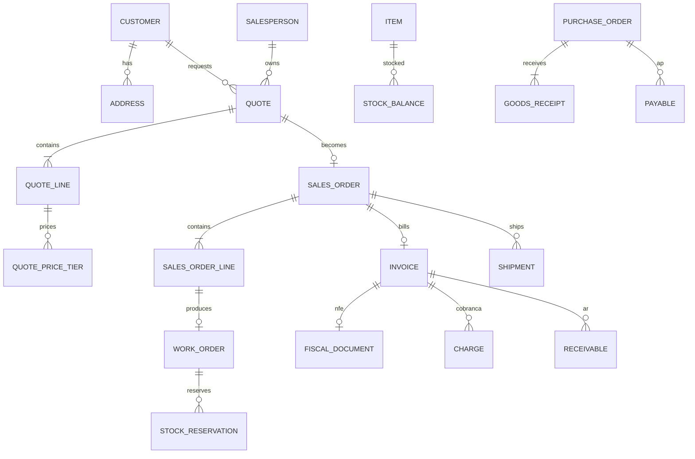

# Sistema de Gestão — Reta Etiquetas

**Empresa:** RLP Etiquetas Auto Adesivos Ltda (Reta Etiquetas)  
**CNPJ:** 01.423.183/0001-10 · EPP · Uberlândia/MG  
**CNAE principal:** 18.13-0-99 — Impressão de material para outros usos  
**Documento:** arquitetura + domínio + estrutura de dados + Docker local→produção  
**Versão:** 1.0 · 23/07/2026  

---

## 1. Objetivo

Substituir o controle manual e o sistema caseiro subutilizado por um **ERP operacional enxuto**, com:

1. **Básico sólido** — cadastros, orçamento, pedido, OS, estoque, compras, faturamento, cobrança, entrega, financeiro.
2. **Crescimento seguro** — monólito modular, dados versionáveis, integrações por adaptadores.
3. **Maturidade progressiva** — do operacional diário até gestão financeira e PCP avançados.

Princípio central: **modelar o negócio de etiquetas adesivas** (não um ERP genérico genérico), reutilizando a inteligência da planilha `ORÇAMENTO OFICIAL 2607171006.xlsm` como motor de custo/preço.

---

## 2. Escopo

### 2.1 Incluído (fase atual)

| Domínio | Capacidade |
|--------|------------|
| Cadastros | Cliente/fornecedor, endereços, vendedores, produtos/insumos, máquinas, facas |
| Comercial | Orçamento inteligente → Pedido |
| Produção | Ordem de serviço, consumo de insumos, status de chão |
| Estoque | Saldo, reserva, movimentação, alerta de ruptura |
| Compras | Pedido de compra, recebimento, vínculo com contas a pagar |
| Fiscal (parcial) | NF-e de **saída** (produto) via hub |
| Cobrança | Boleto/BolePix/Pix via **Banco Inter** |
| Entrega | Remessa, confirmação e validação de entrega |
| Financeiro | Contas a receber/pagar, baixa manual, ciclo de caixa |
| Integrações free | Consulta CNPJ e CEP |

### 2.2 Explicitamente fora (neste momento)

- **NFS-e** (serviços)
- **Importações** (comércio exterior / DI / SISCOMEX)
- E-commerce integrado ao site WordPress (só lead → orçamento, depois)
- Contabilidade completa / SPED (fase posterior)
- Pagamentos bancários automáticos (TED/Pix saída) — **apenas controle**; baixa manual

### 2.3 Fontes de verdade atuais

| Fonte | Uso no novo sistema |
|-------|---------------------|
| Planilha de orçamento | Motor de precificação (tabelas + fórmulas → domínio) |
| Sistema caseiro (`ro.retaetiquetas.com.br`) | Referência de fluxo Contas a Receber; **não** migrar lógica frágil |
| Site institucional | Canal de lead; não é o ERP |
| Banco Inter API | Cobrança + extrato (conciliação futura) |
| Hub NF-e (ex.: Focus NFe) | Emissão/consulta NF-e saída |

> **Segurança:** credenciais que aparecem em arquivos de levantamento **não devem** ir para o repositório. Usar `.env` / secrets e rotacionar o que já vazou em texto puro.

---

## 3. Princípios de engenharia

1. **Monólito modular primeiro** — um deploy, vários *bounded contexts* claros. Microserviços só quando houver dor real (escala, time, ciclo de release).
2. **Ubiquitous language** — nomes do chão: Orçamento, Pedido, OS, Faca, Bobina, Tubete, Matriz, Rebobinação.
3. **Eventos de domínio** — cada transição relevante gera evento (`PedidoAprovado`, `OSIniciada`, `EstoqueReservado`, `NFeAutorizada`, `CobrancaPaga`, `EntregaConfirmada`).
4. **Idempotência nas integrações** — Inter e hub fiscal com `idempotency_key` / correlação.
5. **Soft delete + auditoria** — quem mudou status, preço, estoque e financeiro.
6. **Dinheiro em centavos (inteiro)** ou `NUMERIC(14,2)` com política única; **nunca** float para dinheiro.
7. **Unidades de medida explícitas** — m², m linear, rolo, un, kg, hora-máquina.
8. **Local = espelho de produção** — mesmos containers, só trocam secrets, volumes e hosts.

---

## 4. Roadmap de maturidade

```
Nível 0 — Papel/planilha/manual          (hoje)
Nível 1 — Operacional básico             (MVP Docker local)
Nível 2 — Integração financeira/fiscal   (Inter + NF-e)
Nível 3 — Gestão (ciclo de caixa, MRP leve, KPIs)
Nível 4 — Excelência (PCP, conciliação, BI, site→lead)
```

| Nível | Entrega | Critério de “pronto” |
|-------|---------|----------------------|
| **1** | Cadastros + Orçamento + Pedido + OS + Estoque + Compras + AR/AP manuais + Entrega | Fluxo completo sem papel |
| **2** | NF-e saída + Cobrança Inter + webhooks | Emitir cobrança e baixar automaticamente |
| **3** | Reserva de estoque na OS, alerta de compra, regra prazo pagar > receber, dashboard | Decisão gerencial no sistema |
| **4** | Capacidade máquina, fila OS, extrato Inter, custo real vs orçado | Melhoria contínua mensurável |

Este documento detalha **Níveis 1–3** com ganchos para o 4.

---

## 5. Fluxo operacional canônico

```
Lead / Cliente
    ↓
[1] ORÇAMENTO  ──(reprovado/expirado)──→ arquivado
    ↓ aprovado
[2] PEDIDO
    ↓
[3] ORDEM DE SERVIÇO  ←── reserva/consumo de ESTOQUE
    │                      └── se faltar → COMPRA
    ↓ produzido
[4] FATURAMENTO
    ├── NF-e saída (hub)
    └── Cobrança (Inter: boleto/bolepix/pix)
    ↓
[5] ENTREGA ──→ confirmação / validação
    ↓
[6] RECEBIMENTO (baixa AR) ← webhook Inter ou baixa manual
```

### 5.1 Máquinas de estado (resumo)

**Orçamento:** `rascunho → enviado → aprovado | reprovado | expirado | cancelado`  
**Pedido:** `aberto → em_producao → faturado → entregue → encerrado | cancelado`  
**OS:** `planejada → liberada → em_execucao → pausada → concluida | cancelada`  
**Cobrança:** `pendente → emitida → paga | vencida | cancelada | baixa_manual`  
**Entrega:** `aguardando → expedida → em_transito → entregue | recusada | extravio`  
**Conta a pagar:** `aberta → parcial → paga | cancelada`

Regra dura: **não pular etapas sem papel de auditoria** (ex.: faturar sem OS concluída exige perfil gerente + motivo).

### 5.2 Regra de ciclo de caixa (gestão)

Para cada pedido/condição comercial:

```
prazo_medio_pagamento_fornecedores  ≥  prazo_medio_recebimento_cliente
```

Na prática do MVP:

- Condicao comercial do cliente: `D+X` / `N/DD` etc.
- Pedido de compra: vencimento sugerido ≥ data prevista de recebimento do cliente + folga configurável (ex.: +5 dias).
- Sistema **alerta** (bloqueio só se política da empresa exigir).

---

## 6. Contextos delimitados (módulos)

```
┌─────────────────────────────────────────────────────────────┐
│                     API Gateway / App Web                     │
└─────────────────────────────────────────────────────────────┘
┌──────────┬──────────┬──────────┬──────────┬─────────────────┐
│ Identity │ Party    │ Catalog  │ Pricing  │ Commercial      │
│ (auth)   │ (pessoas)│ (itens)  │ (motor)  │ (orç./pedido)   │
├──────────┼──────────┼──────────┼──────────┼─────────────────┤
│ PCP      │ Inventory│ Purchasing│ Billing │ Finance         │
│ (OS)     │ (estoque)│ (compras) │ (NF/cob)│ (AR/AP)         │
├──────────┴──────────┴──────────┴──────────┴─────────────────┤
│              Integration Adapters (Inter, Focus, CNPJ, CEP)  │
└─────────────────────────────────────────────────────────────┘
```

Comunicação interna: **chamadas de aplicação + outbox de eventos** (tabela `outbox_events`), não HTTP entre módulos no MVP.

---

## 7. Modelo de domínio (entidades principais)

### 7.1 Party / Cadastros

| Entidade | Descrição |
|----------|-----------|
| `Organization` | Empresa emitente (Reta) — multi-empresa futuro |
| `Party` | Pessoa/empresa genérica |
| `Customer` | Cliente (extends Party) + limite crédito, condição padrão |
| `Supplier` | Fornecedor + lead time, condição pagamento |
| `Address` | Endereços (comercial, cobrança, **entrega**) N:1 Party |
| `Contact` | Telefone/e-mail |
| `Salesperson` | Vendedor / comissão padrão |
| `User` / `Role` | Acesso RBAC |

Enrichment:

- CNPJ: BrasilAPI / ReceitaWS / OpenCNPJ (free) → preenche razão, fantasia, CNAE, endereço.
- CEP: ViaCEP / BrasilAPI → completa logradouro.

### 7.2 Catálogo e engenharia de produto

| Entidade | Descrição |
|----------|-----------|
| `Item` | SKU unificado (insumo, serviço, acabamento, embalagem) |
| `ItemType` | `papel`, `tinta`, `verniz`, `tubete`, `caixa`, `acabamento`, `matriz`, `servico`, `outro` |
| `Uom` | un, m2, m, rolo, h, kg |
| `Machine` | BETA, 160, 250, ETIRAMA, BATIDA, MODULAR… |
| `Die` (Faca) | medida, Z/repetição, colunas, mapa de facas |
| `BomTemplate` | receita típica por tipo de etiqueta (fase 3+) |

A planilha vira **tabelas mestres versionadas**:

- `price_paper`, `price_finish`, `price_tube`, `price_ink`, `price_machine_hour`, `price_box`, `waste_paper`, `waste_finish`, `tax_rate`, `commission_rate`

Cada alteração de tabela gera `price_table_version` — orçamentos antigos **congelam** a versão usada.

### 7.3 Comercial — Orçamento (núcleo)

Espelha a aba ORÇAMENTO + parâmetros:

**Cabeçalho `Quote`**

- cliente, vendedor, validade, status, versão tabela preço, observação
- imposto % (`tax_percent`), comissão %
- máquina que roda / máquina custo hora
- flags: usa matriz? 1º pedido?

**Item `QuoteLine` (spec técnica)**

- medida (ex. 5,0×2,5), largura papel, puxada máquina
- cores, papel (`Item`), acabamento
- qtd modelos, qtd colunas, etiquetas por rolo
- tubete, faca, repetição Z, coluna rebobinação
- quantidades simuladas (faixas: 10k, 20k, 40k, 60k…)

**Resultado `QuotePriceTier` (por quantidade)**

- metragem linear, m², perdas, rolos, caixas
- horas máquina / troca produto / troca bobina
- custos: papel, máquina, tinta, acabamento, rebobinação, tubete, caixa
- subtotal serviço + imposto + comissão
- valor etiqueta (ceiling), valor matriz (1º pedido), total

**Motor:** serviço puro `PricingEngine.calculate(spec, qty, priceVersion)` — portar fórmulas da planilha com testes de regressão contra casos conhecidos (ex.: Banca do Dinei).

### 7.4 Pedido e OS

| Entidade | Papel |
|----------|-------|
| `SalesOrder` | Congela preço aprovado; condição pagamento; endereços entrega |
| `SalesOrderLine` | Ligação `QuoteLine` + qty escolhida |
| `WorkOrder` | OS por linha ou agrupada; máquina; faca; datas; operador |
| `WorkOrderMaterial` | Itens planejados a consumir |
| `StockReservation` | Reserva ao liberar OS |
| `StockMovement` | Entrada/saída/ajuste/consumo OS/recebimento compra |

### 7.5 Compras e estoque

| Entidade | Papel |
|----------|-------|
| `PurchaseOrder` / `PurchaseOrderLine` | Compra de insumos |
| `GoodsReceipt` | Recebimento (aumenta estoque + gera AP) |
| `Warehouse` / `StockBalance` | Saldo por item/local |
| `ReorderPolicy` | estoque mínimo / ponto de pedido (nível 3) |

Fluxo estoque na OS:

1. Ao **liberar OS** → reserva insumos calculados (m² papel + perdas, tinta, tubete, caixa…).
2. Ao **concluir OS** → consome reserva (movimento `consumo_os`).
3. Se saldo disponível < necessário → sugere `PurchaseOrder` (ou bloqueia conforme política).

### 7.6 Faturamento, cobrança, entrega, financeiro

| Entidade | Papel |
|----------|-------|
| `Invoice` | Documento interno de faturamento (liga pedido) |
| `FiscalDocument` | NF-e (chave, status SEFAZ, XML/PDF, hub id) — **somente NF-e** agora |
| `Charge` | Cobrança Inter (nosso número, pix, pdf, status) |
| `Shipment` | Remessa / volumes / transportadora / tracking |
| `DeliveryConfirmation` | Quem recebeu, quando, evidência (foto/assinatura futura) |
| `Receivable` / `Payable` | Títulos |
| `PaymentAllocation` | Baixas (manual ou webhook) |
| `BankAccount` | Conta Inter (metadados; tokens fora do DB em secret) |

---

## 8. Modelo de dados lógico (relacional)

PostgreSQL. Schemas por contexto (mesmo database):

```
app_auth | party | catalog | pricing | commercial
pcp | inventory | purchasing | billing | finance | integration
```

### 8.1 Diagrama (essencial)



### 8.2 Convenções de colunas

Toda tabela de negócio:

| Coluna | Tipo | Nota |
|--------|------|------|
| `id` | UUID PK | `gen_random_uuid()` |
| `organization_id` | UUID | tenant futuro |
| `created_at` / `updated_at` | timestamptz | |
| `created_by` / `updated_by` | UUID null | |
| `deleted_at` | timestamptz null | soft delete |
| `version` | int | optimistic lock em docs financeiros |

Números de documento: `QUOTE-2026-000123` via sequence por tipo/ano.

Detalhamento SQL: ver [`schema-mvp.sql`](./schema-mvp.sql).

---

## 9. Motor de orçamento (da planilha → domínio)

### 9.1 Entradas (usuário)

- Cliente, vendedor, data  
- Medida / faca (lookup mapa de facas)  
- Cores, papel, acabamento  
- Modelos, colunas, etiq/rolo, tubete  
- Máquina, imposto %, matriz sim/não  
- Faixas de quantidade  

### 9.2 Cálculos (portar com testes)

Para cada quantidade `Q`:

1. Metragem linear ≈ `(puxada_cm/100) * Q / colunas`  
2. m² ≈ `ceil(Q * largura * puxada / 10000, 0.1)`  
3. Perdas (papel por cores; acabamento por tipo; troca bobina se linear > 1000)  
4. Horas máquina / parada / troca bobina  
5. Custos unitários via VLOOKUP das tabelas  
6. Soma custos → + comissão% + imposto%  
7. `valor_etiqueta = ceil(total, 10)` (política atual da planilha)  
8. Matriz: cobrar no 1º pedido se flag  

### 9.3 Inteligência além da planilha (nível 2–3)

- Sugerir máquina pela capacidade/carga  
- Alertar se papel escolhido está abaixo do mínimo de estoque para a OS estimada  
- Comparar margem mínima configurável antes de enviar orçamento  
- Snapshot imutável do cálculo no PDF do orçamento  

---

## 10. Integrações

| Sistema | Uso | Adapter |
|---------|-----|---------|
| **Banco Inter** | Cobrança BolePix + consulta; extrato depois | `InterBillingAdapter`, `InterStatementAdapter` |
| **Hub NF-e** (Focus NFe ou equivalente) | Emissão/consulta/cancelamento NF-e saída | `NFeIssuerAdapter` |
| **BrasilAPI / ViaCEP** | CNPJ + CEP | `CnpjLookup`, `CepLookup` |
| Site WP | Futuro: webhook lead | fora do MVP |

Padrão adapter:

```
Application Service → Port (interface) → Adapter HTTP
                              ↘ FakeAdapter (local/dev)
```

Ambiente local: **Fake Inter** e **Fake NFe** emitem payloads realistas sem certificado.

---

## 11. Arquitetura Docker (local → produção)

### 11.1 Topologia local (`docker compose`)

```
                 ┌──────────────┐
  browser ──────►│  caddy/nginx │
                 └──────┬───────┘
            ┌───────────┼───────────┐
            ▼           ▼           ▼
         web (SPA)   api (app)   adminer*
            │           │
            │     ┌─────┴──────┐
            │     ▼            ▼
            │  postgres      redis
            │     │
            │     ▼
            │  minio (S3 local)
            │
            └── workers (fila: PDF, webhooks, e-mail)
```

\*Adminer/pgAdmin só em local.

Serviços mínimos:

| Serviço | Imagem / build | Função |
|---------|----------------|--------|
| `api` | app Node/Python | REST + jobs leves |
| `worker` | mesma imagem | outbox, webhooks, PDF |
| `web` | frontend | UI |
| `db` | postgres:16 | dados |
| `redis` | redis:7 | fila / cache |
| `minio` | minio | XML NF-e, PDF boleto, evidências |
| `mailpit` | mailpit | e-mail local |
| `proxy` | caddy | TLS local opcional |

### 11.2 Migração para produção (sem reescrever)

| Local | Produção |
|-------|----------|
| Compose numa VM | Compose / Swarm / ECS / K8s (mesmo Dockerfile) |
| Volume Postgres | RDS / managed Postgres / VM com backup |
| Minio | S3 / R2 / compatible |
| Mailpit | SES / Resend / SMTP |
| Fake Inter/NFe | Credenciais reais + mTLS |
| `.env` arquivo | Secrets Manager / sops / vault |
| Um nó | API+worker escaláveis horizontalmente |

Checklist produção:

1. Mesmas migrations Flyway/Liquibase/Prisma  
2. Healthchecks `/health` `/ready`  
3. Backup diário + restore testado  
4. Logs estruturados JSON + correlation id  
5. Webhooks Inter com HTTPS público e assinatura  

### 11.3 Estrutura de repositório sugerida

```
reta-gestao/
├── apps/
│   ├── api/
│   ├── worker/
│   └── web/
├── packages/
│   ├── domain/          # entidades + pricing engine
│   ├── db/              # migrations
│   └── sdk-integrations/
├── deploy/
│   ├── docker-compose.yml
│   ├── docker-compose.prod.yml
│   └── caddy/nginx
├── docs/
└── .env.example
```

Stack recomendada (profissional e aderente ao time enxuto):

| Camada | Escolha | Por quê |
|--------|---------|---------|
| API | **NestJS (TypeScript)** ou FastAPI | Modular, tipado, bom para ERP |
| DB | **PostgreSQL 16** | Relacional + JSONB para snapshot orçamento |
| ORM | Prisma ou SQLAlchemy/SQLModel | Migrations claras |
| Front | **Next.js** | App interno + PDF/print |
| Fila | Redis + BullMQ / Celery | Webhooks e PDF |
| Auth | JWT + refresh; depois SSO | RBAC por papel (vendas, PCP, financeiro, admin) |

---

## 12. Papéis e permissões (RBAC)

| Papel | Pode |
|-------|------|
| `vendedor` | Clientes, orçamentos, pedidos próprios |
| `pcp` | OS, máquinas, facas, estoque leitura |
| `estoque` | Movimentos, inventário, compras |
| `financeiro` | AR/AP, cobranças, baixas |
| `faturamento` | NF-e, liberar faturamento |
| `gerente` | Aprovações, override, tabelas preço |
| `admin` | Usuários, integrações, organização |

---

## 13. Telas mínimas (MVP UI)

1. Dashboard (pedidos abertos, OS do dia, AR vencendo, estoque crítico)  
2. Clientes + endereços (CNPJ/CEP)  
3. Orçamento (wizard técnico + faixas de preço + PDF)  
4. Pedidos  
5. Ordens de serviço  
6. Estoque (saldos + movimentos)  
7. Compras  
8. Faturamento / NF-e  
9. Cobranças Inter  
10. Entregas  
11. Contas a receber / pagar  
12. Tabelas de preço (papel, acabamento, etc.)  

---

## 14. Fases de implementação

### Fase A — Fundação (2–4 semanas)

- Docker Compose + Postgres + auth + Party/Customer/Address  
- Catálogo de itens + importação inicial das abas da planilha  
- PricingEngine + testes vs planilha  
- CRUD Orçamento + PDF  

### Fase B — Operação (3–5 semanas)

- Pedido ← orçamento aprovado  
- OS + reserva/consumo estoque  
- Compras + recebimento  
- AR/AP manuais + entregas  

### Fase C — Integrações (2–4 semanas)

- Adapter Inter (sandbox → prod)  
- Adapter NF-e  
- Webhooks + conciliação simples  

### Fase D — Gestão (contínuo)

- Alertas ciclo de caixa  
- Estoque mínimo / sugestão compra  
- Margem e custo real vs orçado  
- Extrato Inter  

---

## 15. Qualidade e testes

| Tipo | Foco |
|------|------|
| Unitário | `PricingEngine` (casos da planilha) |
| Integração | migrations + repositórios |
| Contrato | adapters fake vs payloads Inter/Focus |
| E2E | fluxo orçamento→recebimento em Compose |
| Regressão | snapshot JSON do cálculo |

Meta: **nenhuma fórmula crítica só no frontend**.

---

## 16. Riscos e decisões

| Risco | Mitigação |
|-------|-----------|
| Planilha com VBA/legado | Extrair tabelas; reimplementar fórmulas testáveis |
| Certificado mTLS Inter | Volume secret; nunca no git |
| Hub NF-e vendor lock | Interface `NFeIssuerPort` |
| Scope creep (NFS-e, importação) | Fora do backlog até Nível 3 estável |
| Site WP quebrado | Tratar à parte; ERP não depende dele |

**Decisão fiscal agora:** apenas **NF-e de produto (saída)**. NFS-e e notas de entrada complexas/importação ficam para depois (compras registram recebimento interno + AP; XML de entrada pode ser anexado sem parsing fiscal completo).

---

## 17. Glossário

| Termo | Significado |
|-------|-------------|
| Faca | Ferramenta de corte; define medida/repetição |
| Puxada | Avanço da máquina por repetição |
| Tubete | Núcleo do rolo (1", 1,5", 3") |
| Matriz | Custo de clichê/matriz — tipicamente 1º pedido |
| BolePix | Boleto + QR Pix (Inter) |
| OS | Ordem de serviço de produção |

---

## 18. Documentos relacionados

- [`schema-mvp.sql`](./schema-mvp.sql) — DDL inicial  
- [`DOCKER-LOCAL-PROD.md`](./DOCKER-LOCAL-PROD.md) — compose e promoção  
- [`MOTOR-ORCAMENTO.md`](./MOTOR-ORCAMENTO.md) — mapeamento planilha → engine  
- [`FLUXO-OPERACIONAL.md`](./FLUXO-OPERACIONAL.md) — passo a passo usuário  

---

## 19. Próximo passo recomendado

1. Validar este modelo com a operação (vendas + produção + financeiro) — 1 reunião.  
2. Subir esqueleto Docker + schema.  
3. Portar **um** caso real da planilha no `PricingEngine` com teste verde.  
4. Só então UI do wizard de orçamento.
