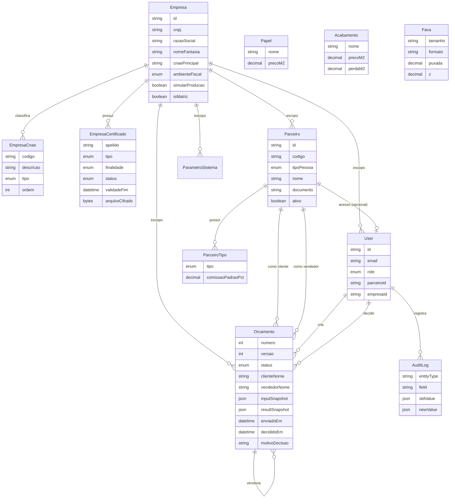

# Modelo de dados (ER resumido)

## Empresa (raiz do sistema)

A **Empresa** é o cadastro único da emitente — raiz organizacional do sistema.

- `Empresa` = identidade fiscal/comercial da gráfica (CNPJ, IE/IM, endereço, regime)
- `EmpresaCnae` = CNAE principal + secundários (fonte de verdade; código 7 dígitos + descrição)
- `EmpresaCertificado` = certificados A1/A3 (NFS-e, NF-e…) com arquivo/senha cifrados
- `ambienteFiscal` = `HOMOLOGACAO` (teste) ou `PRODUCAO`
- `simularProducao` = em teste: UI/APIs comportam-se como produção **sem** emissão fiscal real

Consulta CNPJ (BrasilAPI / Minha Receita) preenche CNAE principal e secundários automaticamente.

Fase 1 = **single-tenant** (uma matriz). O modelo já admite filiais via `parentId` e escopo `empresaId` em User, Parceiro, Orçamento e parâmetros.

## Parceiros (Party / Business Partner)

Um único cadastro comercial (`Parceiro`) acumula um ou mais papéis via `ParceiroTipo`:

| Tipo | Uso |
|---|---|
| `CLIENTE` | Destinatário do orçamento / proposta |
| `FORNECEDOR` | Fornecedores (ex.: facas, insumos) |
| `VENDEDOR` | Responsável comercial; pode carregar `%` comissão padrão |
| `USUARIO` | Indica vínculo com credenciais de login |

**Separação de responsabilidades**

- `Empresa` = raiz emitente (não misturar com parceiro cliente).
- `Parceiro` = dados mestres comerciais (identidade, contato, endereço).
- `User` = autenticação (e-mail, hash de senha, `Role` de acesso).
- Ligação 1:0..1 (`User.parceiroId`) só quando o parceiro tem tipo `USUARIO`.
- Orçamento guarda **FK + snapshot de nome** (`clienteNome` / `vendedorNome`) para imutabilidade comercial.

## Ciclo de vida do orçamento (decisão comercial)

| Status | Label UI | Editável / excluível |
|---|---|---|
| `RASCUNHO` | Rascunho | Sim |
| `ENVIADO` | Aguardando aprovação | Sim |
| `APROVADO` | Aprovado | **Não** |
| `REPROVADO` / `PERDIDO` | Reprovado | **Não** |

Fluxo: `RASCUNHO` → `ENVIAR` → `ENVIADO` → `APROVAR`/`REPROVAR` → status final.

- Enquanto pendente (`RASCUNHO` / `ENVIADO`), o orçamento pode ser editado ou excluído.
- Após a decisão, `decididoEm` + `decididoPorId` (+ `motivoDecisao` na reprovação) congelam o registro.
- PDF comercial (`GET /api/orcamentos/:id/pdf`) gera proposta A4 **paisagem** com logo da marca, sem breakdown de custo.

## Princípios

- **Empresa como raiz**: novos registros herdam `empresaId` da matriz ativa.
- **Snapshots** no orçamento: preços e resultado congelados na versão enviada.
- **Cadastros vivos** alimentam só novos cálculos.
- **AuditLog** obrigatório em mudança de preço, CRUD de parceiros e empresa/certificados.
- **Certificados**: senha e `.pfx` em AES-256-GCM derivados de `AUTH_SECRET`; nunca em texto puro.
- **Soft-delete** de parceiro com orçamentos: inativa (`ativo=false`) em vez de apagar histórico.

## Ciclo operacional (extensão)

Ver especificação completa em [CICLO_OPERACIONAL.md](./CICLO_OPERACIONAL.md).

Entidades principais: `Produto`, `Deposito`, `EstoqueSaldo` / `EstoqueMovimento` / `EstoqueReserva`, `PedidoVenda` ← `Orcamento`, `OrdemServico`, `NecessidadeCompra`, `PedidoCompra`, `DocumentoFiscalEntrada`, `DocumentoFiscalSaida`, `TituloReceber`, `CobrancaInter`, `EntregaPedido`, `EmpresaIntegracao` (Focus / Inter).

Roles adicionais: `PCP`, `COMPRAS`, `FINANCEIRO`, `EXPEDICAO`.
