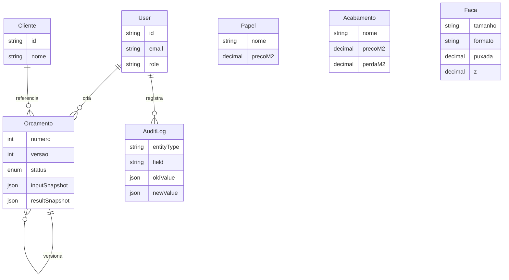

# Modelo de dados (ER resumido)

## Princípios

- **Snapshots** no orçamento: preços e resultado congelados na versão enviada (imutabilidade comercial).
- **Cadastros vivos** alimentam só novos cálculos.
- **AuditLog** obrigatório em mudança de preço.
- **Lookups** (caixas, tarifas) normalizados para o motor puro receber `CatalogLookups`.
