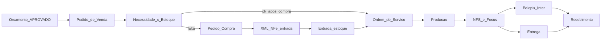

# Ciclo operacional — Pedido → OS → Estoque/Compra → Produção → Faturamento → Entrega → Recebimento

Especificação de implementação. **Não altera** o núcleo existente (Empresa, Parceiro, Orçamento, motor de preço, catálogos XLSM, auth, ambiente fiscal). Só **estende** com novos bounded contexts.

Referências externas:

- [Focus NFe](https://doc.focusnfe.com.br/reference/introducao)
- [Inter Cobrança Bolepix](https://developers.inter.co/references/cobranca-bolepix)
- [Inter Extrato](https://developers.inter.co/references/banking#tag/Extrato)
- Fixtures: `modelos/nfs/` (NFS-e saída)

---

## 1. Invariantes (não comprometer)

| Invariante | Regra |
|---|---|
| Empresa raiz | Todo novo registro carrega `empresaId` da matriz |
| Orçamento imutável após decisão | Aprovado não é editado; vira **origem** do Pedido via snapshot |
| Snapshots | Pedido, OS, NF e títulos congelam nomes, preços, specs |
| Motor de preço | Continua puro em `pricing-engine`; sem I/O fiscal/estoque |
| Certificados / secrets | Mesmo padrão AES-GCM + `AUTH_SECRET` |
| Ambiente | `HOMOLOGACAO` / `PRODUCAO` + `simularProducao` vale para Focus e Inter |
| Soft-delete | Parceiro/produto com histórico: `ativo=false` |
| AuditLog | Preço, estoque manual, fiscal, financeiro, status críticos |
| Papéis | Estender `Role` sem quebrar ADMIN / VENDEDOR / ORCAMENTISTA |

**Evidência de negócio:** XMLs em `modelos/nfse/` são **NFS-e Nacional** (impressões / composição gráfica). XMLs em `modelos/nfe/` são **NF-e** de produtos/mercadorias. Faturamento padrão de etiqueta impressa = **NFS-e**; NF-e quando o item é mercadoria (`documentoSaidaPadrao=NFE`) ou insumo comercializado.

---

## 2. Arquitetura em contextos

```
[Comercial]     Orçamento (existente) → Pedido Venda
[PCP]           Ordem de Serviço + Produção
[Suprimentos]   Necessidade → Compra → Entrada NFe
[Estoque]       Produto · Saldo · Reserva · Movimento
[Fiscal]        Focus (NFe recebida / NFe·NFSe saída)
[Financeiro]    Título · Bolepix Inter · Conciliação
[Integrações]   Adaptadores Focus + Inter (sandbox/prod)
```

Camadas: `domain/*` (puro) → `services/*` (orquestração) → `infra/focus|inter|nfe-xml` → UI App Router.

O `pricing-engine` **não** conhece estoque nem Focus.

---

## 3. Cadastro de produtos

### Tipos

| Tipo | Uso |
|---|---|
| `INSUMO` | Papel, tinta, verniz, tubete, caixa… |
| `ACABADO` | Etiqueta/serviço vendável |
| `SERVICO` | Linha fiscal NFS-e (pode sem saldo) |
| `INTERMEDIARIO` | Opcional (fase 2) |

### Campos mestres

Código (único/empresa), descrição comercial/fiscal, unidade, NCM, origem, CEST, CFOP padrão, códigos serviço NFS-e (`cTribNac`, `cNBS`), controle de estoque, mínimo, custo médio, vínculos opcionais com `Papel` / `Acabamento` / `Tubete`, `ProdutoFornecedor` (matching XML).

### BOM / explosão (fase 1)

Explosão na OS usa `inputSnapshot` / `resultSnapshot` do orçamento:

| Necessidade | Origem |
|---|---|
| Papel (m²) | metragem m² + perdas |
| Acabamento (m²) | metragem + perda acabamento |
| Tubete (UN) | qtde rolos |
| Caixa (UN) | qtde caixas |

Cada linha liga a um **Produto INSUMO** via vínculo catálogo→produto. Sem vínculo → `SEM_PRODUTO` (bloqueia reserva automática).

---

## 4. Estoque

- **Deposito** — fase 1: um `PRINCIPAL`
- **EstoqueSaldo** — `(empresa, deposito, produto)` → qtd, reservado, custo médio
- **EstoqueMovimento** — razão append-only
- **EstoqueReserva** — pedido/OS + produto + qtd

**Disponível** = `quantidade - reservado`. Saldo nunca editado na mão.

Tipos de movimento: `ENTRADA_COMPRA`, `RESERVA`, `LIBERA_RESERVA`, `BAIXA_PRODUCAO`, `ENTRADA_PRODUCAO`, `AJUSTE_INVENTARIO`, `ESTORNO`.

---

## 5. Pedido de venda

Origem: só `Orcamento.APROVADO`. Um orçamento → um pedido (faixa escolhida).

Status:

```
RASCUNHO → CONFIRMADO → EM_PRODUCAO → FATURADO → ENTREGUE → LIQUIDADO
                ↓
            CANCELADO
```

Após `CONFIRMADO`: gera OS + explosão MRP + reservas. Preço imutável (nova negociação = novo orçamento).

---

## 6. Ordem de serviço

`PedidoVenda 1 — N OrdemServico` (fase 1 tipicamente 1:1).

Status:

```
PLANEJADA → AGUARDANDO_MATERIAL → LIBERADA → EM_PRODUCAO → CONCLUIDA
```

Parâmetro: `faturamento.exigeOsConcluida` = true.

---

## 7. MRP / ATP

Na confirmação: explodir → reservar possível → gerar `NecessidadeCompra` para faltas → UI “tenho / falta / comprar”.

---

## 8. Compras e entrada NFe

`NecessidadeCompra` → `PedidoCompra` → upload/sync XML → validação → matching item→produto → `CONFERIDO` → `ENTRADA_COMPRA`.

Matching (ordem): EAN (`ProdutoFornecedor`) → código fornecedor → código/SKU interno → NCM+descrição.  
Se não houver cadastro: status do item `PENDENTE_MATCH` (“Sem cadastro”). A UI oferece:

1. **Cadastrar produto** — cria `INSUMO` a partir do XML (código sugerido, NCM, unidade) + `ProdutoFornecedor` + vínculo imediato  
2. **Vincular existente** — escolhe produto já cadastrado e grava o código do fornecedor para match futuro  

Enquanto houver pendência, o documento permanece em `VALIDANDO` e **Lançar estoque** fica bloqueado.

Validações: parse, chave, CNPJ destinatário = Empresa, duplicidade, tolerâncias qtd/valor.

Focus NFe recebidas + fixtures locais.

**Após `ESTOQUE_LANCADO`:** o sistema reavalia ATP das OS afetadas (reserva o disponível e libera a OS quando a cobertura atinge `mrp.percentualMinimoLiberacaoOs`). Abrir o pedido também dispara esse refresh se ainda houver linhas em FALTA/PARCIAL.

---

## 9. Produção

| Ação | Pré-condição | Efeito |
|---|---|---|
| Iniciar | `LIBERADA` | → `EM_PRODUCAO` |
| Concluir | `EM_PRODUCAO` | Baixa insumos, → `CONCLUIDA` |
| Cancelar | Antes de concluir | Libera reservas |

---

## 10. Faturamento + cobrança

| Documento | Quando |
|---|---|
| **NFS-e Nacional** (Focus `/v2/nfsen`) | Prestação de serviço (impressão) — rateio dos custos de máquina/tinta/rebobinação |
| **NF-e** (Focus `/v2/nfe`) | Revenda de mercadoria — rateio dos custos de papel/acabamento/tubete/caixa |
| **Ambas (padrão)** | Todo pedido de etiqueta nasce com 2 itens; faturamento emite as duas notas + Bolepix |

XML/PDF de homologação espelham fixtures em `modelos/nfse` e `modelos/nfe`. Com `simularProducao=true`: docs `simulado=true`, payloads Focus/Inter montados mas sem POST externo.

---

## 11. Entrega e recebimento

- **EntregaPedido** → pedido `ENTREGUE`
- **TituloReceber** + **CobrancaInter** → webhook/consulta/extrato → `PAGO` → pedido `LIQUIDADO`

---

## 12. Homologação ≈ produção

| Aspecto | Comportamento |
|---|---|
| UI / status / bloqueios | Idênticos |
| Estoque / reservas | Reais no banco de homolog |
| Focus / Inter | Sandbox quando `simularProducao=false` + `HOMOLOGACAO` |
| `simularProducao=true` | Não chama externos; grava docs simulados |

---

## 13. Papéis

| Role | Escopo |
|---|---|
| `ADMIN` | Tudo |
| `VENDEDOR` | Converter orçamento→pedido, ver status |
| `ORCAMENTISTA` | Specs |
| `PCP` | OS, produção |
| `COMPRAS` | XML, pedidos compra |
| `FINANCEIRO` | Faturar, boletos, conciliação |
| `EXPEDICAO` | Entrega |

---

## 14. Parâmetros (`ParametroSistema`)

| Chave | Default |
|---|---|
| `estoque.depositoPadraoCodigo` | `PRINCIPAL` |
| `mrp.reservaNaConfirmacao` | `true` |
| `mrp.percentualMinimoLiberacaoOs` | `100` |
| `faturamento.exigeOsConcluida` | `true` |
| `faturamento.documentoPadrao` | `NFSE` |
| `compra.toleranciaQtdPct` | `5` |
| `compra.toleranciaValorPct` | `2` |
| `pedido.liquidacaoExigeEntrega` | `false` |

---

## 15. Sequência de sprints

| Sprint | Entrega |
|---|---|
| A | Produto + NCM + EmpresaIntegracao |
| B | Depósito, saldo, movimento, reserva |
| C | PedidoVenda + OS + ATP |
| D | Compras + XML entrada |
| E | Produção + baixas |
| F | NFSe Focus (+ simulação) |
| G | Bolepix Inter |
| H | Entrega + liquidação |

---

## 16. Critérios de aceite

1. Orçamento aprovado gera pedido com snapshot/preço da faixa
2. Confirmar pedido mostra materiais e cria reservas
3. Falta → compra → XML → estoque → OS libera
4. XML inválido/duplicado não entra estoque
5. Produção só inicia liberada; concluir baixa estoque
6. Faturar gera NFSe + boleto (sandbox ou simulado)
7. Entrega e pagamento fecham `ENTREGUE` / `LIQUIDADO`
8. Orçamento/motor/PDF comercial inalterados
9. AuditLog em confirmação, entrada, faturamento e baixa

---

## 17. Mapa do fluxo (domínio)



---

## 18. Passo a passo na UI (hub)

A home e o menu seguem a ordem operacional pedida pelo negócio:

| # | Etapa | Rota |
|---|---|---|
| 1 | Comprar | `/compras` (tabs necessidades / pedidos / entradas) |
| 2 | Gerar estoque | `/estoque` + lançar entrada |
| 3 | Orçamento | `/orcamentos` |
| 4 | Pedido e OS | `/pedidos/[id]` |
| 5 | Notas fiscais | Faturar na jornada do pedido |
| 6 | Boletos | Mesmo faturamento (Bolepix) |
| 7 | Entrega | CTA na jornada |
| 8 | Recebimento | CTA na jornada |

Deep-link de faltas: `/compras?tab=necessidades&pedido={pedidoId}`.

Reset homologação (preserva cadastros): `npm run db:reset-ops` ou **Cadastros → Resetar dados operacionais**.
