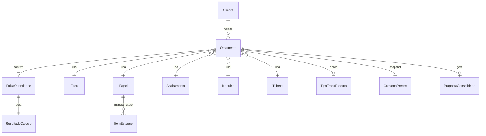

# Modelo de domínio

## Diagrama (relacionamentos)

## Entidades

### Cliente
- nome (B5)
- (futuro: CNPJ, contato — **não está nas planilhas**)

### Orcamento
- data
- largura_papel_cm, cores (inclui `4V`), qtde_modelos, qtde_colunas
- etiq_por_rolo, coluna_rebobinacao
- imposto_pct, matriz_sim_nao, rpm
- maquina_roda_servico (F10 — lista MÁQUINAS!A: BETA/160/250/ETIRAMA/BATIDA/MODULAR; operacional, fora do preço; independente do mapa e de G10)
- maquina_custo_id (G10 — entra no preço)
- overrides de preço (snapshot)
- faca_id, papel_id, acabamento_id, tubete_id
- tipo_troca_produto_id
- prazo_entrega, validade_proposta, tolerancia_qtd_pct (editáveis; defaults 12 dias úteis / 7 dias / 20)
- cobranca_matriz (bool resolvido: 1º pedido desta matriz?)
- vendedor: fora do MVP

### FaixaQuantidade (1..N)
- quantidade
- comissao_pct
- resultado (valores detalhados + totais)

### Faca
- medida (ex. `8,0X12,4`)
- maquina_catalogo, formato, puxada_cm, z, repeticao
- origem: catálogo MAPA DE FACAS

### Papel / Acabamento / Tubete / Maquina
- nome + preço(s) versionados no catálogo

### TipoTrocaProduto
- nome + tempo_horas (de minutos/60)

### CatalogoPrecos
- versão, vigência, itens (papel, tinta, acabamentos, HM, tubete, caixa, matriz_cm2)
- permite override pontual por orçamento `[Validação usuário]`

### ResultadoCalculo
- metragens, perdas, horas, breakdown de custos, etiqueta, matriz, total

### PropostaConsolidada
- linhas por faixa (material, acabamento, rolos, unitário…)
- valor_matriz (mesmo valor em todas as faixas se 1º pedido daquela matriz; 0 se já cobrada)
- prazo_entrega, validade, cláusula tolerância % — **editáveis**

### HistoricoMatrizCobrada (novo — D8)
- cliente_id + identidade da matriz (ver D16)
- orcamento/pedido que cobrou
- valor cobrado, data  
Usado para não cobrar de novo no próximo pedido com a mesma matriz.

### ItemEstoque (fase 2)
- bobina: localização, fornecedor, largura_mm, comprimento_m, descrição, m², saldo
- **sem vínculo de preço com o orçamento no MVP**

## Interação

1. Usuário monta `Orcamento` + N `FaixaQuantidade`.
2. Motor resolve lookups no `CatalogoPrecos` (com overrides).
3. Para cada faixa aplica R1–R20 → `ResultadoCalculo`.
4. `PropostaConsolidada` agrega para o cliente.
5. (Futuro) consulta `ItemEstoque` só para disponibilidade.
