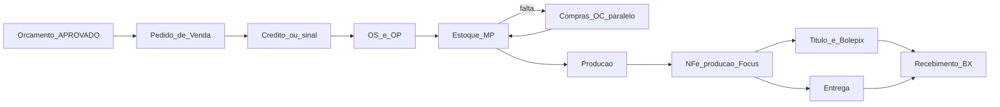

# Ciclo operacional — Orçamento → Pedido → OS/OP → Estoque → Faturamento → Entrega → Recebimento

Especificação alinhada ao estudo `trigger/32` (`INDICE_FLUXO_OPERACIONAL`).

**Compras não é etapa 1 do fluxo feliz** — é suporte paralelo (COT/OC quando OP para por falta).

Referências externas:

- [Focus NFe](https://doc.focusnfe.com.br/reference/introducao)
- [Inter Cobrança Bolepix](https://developers.inter.co/references/cobranca-bolepix)
- Fixtures de venda: `../32/nfe_venda/` (NF-e etiquetas reais)
- Fixtures de compra: `../32/notas_compras/` (entrada)

---

## 1. Invariantes (não comprometer)

| Invariante | Regra |
|---|---|
| Empresa raiz | Todo novo registro carrega `empresaId` da matriz (EMP-00001) |
| Orçamento imutável após decisão | Aprovado não é editado; vira **origem** do Pedido via snapshot |
| Snapshots | Pedido, OS, NF e títulos congelam nomes, preços, specs |
| Motor de preço | Continua puro em `pricing-engine`; sem I/O fiscal/estoque |
| Ambiente | `HOMOLOGACAO` / `PRODUCAO` + `simularProducao` vale para Focus e Inter |
| Soft-delete | Parceiro/produto com histórico: `ativo=false` |
| AuditLog | Preço, estoque manual, fiscal, financeiro, status críticos |

**Evidência de negócio:** XMLs em `../32/nfe_venda/` são **NF-e** de etiquetas (PA) e ribbons (REV).  
Faturamento padrão de etiqueta sob encomenda = **NF-e produção própria** (CFOP 5101/6101).  
NFS-e só para serviço avulso (SVC) quando o contador definir.

---

## 2. Arquitetura em contextos

```
[Comercial]     Orçamento → Pedido Venda (mestre)
[PCP]           Ordem de Serviço + Ordem de Produção
[Estoque]       Reserva / baixa MP / entrada PA / sobra
[Suprimentos]   Necessidade → OC → entrada NFe   ← suporte / exceção
[Fiscal]        Focus NF-e saída (PA/REV) · NFS-e (SVC)
[Financeiro]    TIT- · COB- · BX-
```

Camadas: `domain/*` (puro) → `lib/*` (orquestração) → pacotes Focus/Inter → UI App Router.

---

## 3. Cadastro de produtos (venda)

| Família | Uso | Documento | CFOP |
|---|---|---|---|
| `PA-ETQ-*` | Etiqueta industrializada | NF-e | 5101/6101 |
| `FAC-*` | Ferramental no 1º pedido | Linha na mesma NF-e | 5101/6101 |
| `REV-RIB-*` | Ribbon / revenda | NF-e | 5102/6102 |
| `SVC-*` | Serviço avulso | NFS-e (quando aplicável) | — |
| `MP-*` / insumos | Compra / custo | Não faturar na venda | — |

Um pedido de etiqueta = **uma família PA-ETQ** + especificação comercial no item.  
Não cadastrar milhares de SKUs sob medida.

---

## 4. Estoque

- **Deposito** — fase 1: um `PRINCIPAL`
- **EstoqueSaldo** — `(empresa, deposito, produto)` → qtd, reservado, custo médio
- **EstoqueMovimento** — razão append-only
- **EstoqueReserva** — pedido/OS + produto + qtd

**Disponível** = `quantidade - reservado`.

---

## 5. Pedido de venda

Origem: orçamento **APROVADO** (preferencialmente pelo **link do cliente**).

```
RASCUNHO → AGUARDA_CREDITO | AGUARDA_ADIANTAMENTO → LIBERADO
        → CONFIRMADO → EM_PRODUCAO → PRODUZIDO → FATURADO → ENTREGUE → LIQUIDADO
                ↓
            CANCELADO
```

Após `CONFIRMADO`: gera **OS + OP** + explosão MRP + reservas.

---

## 6. OS e OP

`PedidoVenda 1 — N OrdemServico` e `1 — N OrdemProducao`.

- OS: materiais / reservas / espelho PCP
- OP: chão de fábrica
- Painel: `/producao`

Parâmetro: `faturamento.exigeOsConcluida` = true.

---

## 7. MRP / ATP

Na confirmação: explodir → reservar → `NecessidadeCompra` só para faltas.  
UI do pedido mostra “tenho / falta”; **Compras** abre só se houver urgência.

---

## 8. Compras (suporte — INDICE §2)

Não faz parte da home comercial. Fluxo:

`NecessidadeCompra` → `PedidoCompra` (OC) → XML entrada → matching → `ENTRADA_COMPRA` → libera reservas.

Urgência: OP/`AGUARDANDO_MATERIAL` com vínculo `op_id` quando existir.

---

## 9. Produção

| Ação | Pré-condição | Efeito |
|---|---|---|
| Iniciar | `LIBERADA` / OP empurrada | → `EM_PRODUCAO` |
| Concluir | `EM_PRODUCAO` | Baixa MP, sobra/retalho, → `CONCLUIDA` / `PRODUZIDO` |

---

## 10. Faturamento + cobrança

| Documento | Quando |
|---|---|
| **NF-e** Focus `/v2/nfe` | Padrão — produção própria (PA-ETQ) e revenda (REV) |
| **NFS-e** Focus `/v2/nfsen` | Somente item SVC / serviço avulso |
| **FAC** | Linha na **mesma** NF-e do PA |

Com `simularProducao=true`: docs `simulado=true`, payloads montados sem POST externo.  
Parâmetro: `faturamento.documentoPadrao` = `NFE` (dual desligado).

---

## 11. Entrega e recebimento

- **EntregaPedido** → pedido `ENTREGUE`
- **TituloReceber** + **CobrancaInter** → `PAGO` → `LIQUIDADO`

---

## 12. Homologação ≈ produção

| Aspecto | Comportamento |
|---|---|
| UI / status / bloqueios | Idênticos |
| Focus / Inter | Sandbox quando `simularProducao=false` + `HOMOLOGACAO` |
| `simularProducao=true` | Não chama externos; grava docs simulados |

---

## 13. Papéis

| Role | Escopo |
|---|---|
| `ADMIN` | Tudo |
| `VENDEDOR` | Converter orçamento→pedido |
| `ORCAMENTISTA` | Specs |
| `PCP` | OS, produção |
| `COMPRAS` | OC, XML entrada |
| `FINANCEIRO` | Faturar, boletos, baixa |
| `EXPEDICAO` | Entrega |

---

## 14. Parâmetros

| Chave | Default |
|---|---|
| `estoque.depositoPadraoCodigo` | `PRINCIPAL` |
| `mrp.reservaNaConfirmacao` | `true` |
| `mrp.percentualMinimoLiberacaoOs` | `100` |
| `faturamento.exigeOsConcluida` | `true` |
| `faturamento.documentoPadrao` | `NFE` |
| `faturamento.dualFiscal` | `false` (legado) |
| `compra.toleranciaQtdPct` | `5` |
| `pedido.nfAntesDeExpedir` | `true` |

---

## 15. Mapa do fluxo (domínio)



---

## 16. Passo a passo na UI (hub)

| # | Etapa | Rota |
|---|---|---|
| 1 | Orçamento | `/orcamentos` |
| 2 | Pedido (jornada) | `/pedidos/[id]` |
| 3 | Produção | `/producao` + CTAs na jornada |
| 4 | Notas / boletos | Faturar na jornada |
| 5 | Entrega | CTA na jornada |
| 6 | Recebimento | CTA / `/financeiro?tab=receber` |
| — | Estoque (suporte) | `/estoque` |
| — | Compras (suporte) | `/compras` — só se houver faltas/urgência |

Deep-link de faltas: `/compras?tab=necessidades&pedido={pedidoId}`.

Reset homologação: `npm run db:reset-ops` ou **Cadastros → Resetar dados operacionais**.
