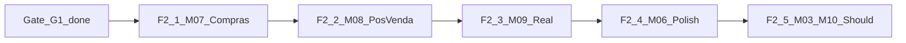

# Fase 2 Should — Outline (pós Gate G1)

**Pré-condição:** health `fase: "1-must-complete"` · Fase 1 Must fechada.  
**ADR:** CAMINHO-A · não iniciar código de Fase 2 sem gate.  
**Domínio RO:** `trigger/32` — UCs com prioridade **S** (Should).

Este documento **detalha** a Fase 2; a implementação começa na onda F2-1 quando priorizada.

---

## Princípios

1. Uma onda = um bounded context (ou fatia fina de integração).
2. Stubs continuam válidos até haver credenciais (Focus homolog, Inter sandbox, Meta WABA).
3. Params oficiais: manter `PENDENTE_RATIFICACAO` até direção/contador.
4. Sem LAI, sem SPED/eSocial no ERP, sem microsserviços.

---

## F2-1 — M07 Compras (Should) — **FEITO**

Implementado em `apps/api/src/modules/compras/` + UI `/compras` · health `2-m07`.

| Ordem | Entrega | Status |
|-------|---------|--------|
| 1 | XML compra → MOV `ENTRADA_COMPRA` | OK |
| 2 | COT → OC com alçada | OK |
| 3 | OP `AGUARDANDO_MATERIAL` | OK |

---

## F2-2 — M08 Pós-venda (Should) — **PRÓXIMO**

**UCs:** UC-POS-001…005 · `POS_VENDA_RMA_GARANTIA.txt`, `DEVOLUCAO_VENDA_PONTA_A_PONTA.txt`

| Ordem | Entrega |
|-------|---------|
| 1 | RMA → CQ → decisão (reparo/reposição/crédito) |
| 2 | DEV ponta a ponta: estorno fiscal + estoque + financeiro sem apagar origem |
| 3 | Homologar **1 caso controlado** com dados reais (não massa) |

**Aceite:** DEV não usa DELETE físico; trilhas de auditoria completas.

---

## F2-3 — M09 Integrações reais (Should)

**UCs:** UC-INT-003 (WA Meta), Bank sandbox · `INTEGRACAO_WHATSAPP_BUSINESS_API.txt`, `INTEGRACAO_BANCARIA_MULTI_PROVIDER.txt`

| Ordem | Entrega |
|-------|---------|
| 1 | `WA_ADAPTER=http` Meta Cloud API + templates ORC/NF/cobrança |
| 2 | BankProvider Inter sandbox → depois Sicoob prod |
| 3 | Focus homolog com token real (já há HTTP adapter) |

**Aceite:** kill-switch continua valendo; webhooks reais com idempotência; sem WhatsApp pessoal.

---

## F2-4 — M06 polish (Should)

**UCs:** UC-FIN-007…009 · CNAB residual

| Ordem | Entrega |
|-------|---------|
| 1 | CNAB/arquivo retorno além do webhook |
| 2 | Régua de cobrança via WA oficial |
| 3 | Comissão (COM); frete gerencial (sem CT-e) |
| 4 | Entrega fracionada multi-ENT |

---

## F2-5 — M03 / M10 Should

| Módulo | Entrega |
|--------|---------|
| M03 | Amostragem/CQ/certificado; manutenção preventiva (BEM ref) |
| M10 | DRE/caixa interno; patrimônio BEM; RH pagamento gerencial; import folha RLP-FOLHA-v1 |
| Could | UC-GER-006 acumulado faturamento (prep Lucro Real); EMP-00002 se Contador+Direção |

---

## Gate G2 (futuro)

Declarar Fase 2 “operável” quando:

1. XML compra + 1 RMA/DEV homologados
2. Pelo menos um adapter real (Focus homolog **ou** Bank sandbox **ou** WA Meta) em uso
3. Health sobe para marcador acordado (ex.: `2-should-core`)

---

## Não fazer na Fase 2

- Reabrir LAI / livro paralelo
- SPED / eSocial completo no ERP
- Microsserviços / GraphQL obrigatório
- Ativar EMP-00002 sem parecer Contador+Direção
