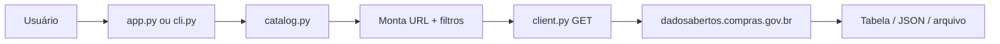

# Sistema de Consulta — API Compras.gov.br (Dados Abertos v2.0)

Consulta **profissional, organizada e portável** à API pública de **Dados Abertos** do Compras.gov.br, com base no manual **API v2.0 (Fev/2026)** e na especificação OpenAPI oficial.

- **Swagger:** https://dadosabertos.compras.gov.br/swagger-ui/index.html  
- **OpenAPI:** https://dadosabertos.compras.gov.br/v3/api-docs  
- **Manual de referência:** `api_compras_v2_documentacao (v2.0).pdf` (pasta pai)

---

## O que este sistema faz

| Recurso | Descrição |
|---------|-----------|
| **Interface web** | Navegação por módulo, formulários de filtros, tabela + JSON, download |
| **Linha de comando (CLI)** | Automação, scripts e integração |
| **Catálogo completo** | Todos os endpoints do OpenAPI, com indicação público vs. login |
| **Sem credenciais** | Apenas dados abertos; rotas `/alice` e `/usuarios` ficam bloqueadas |

---

## Módulos cobertos (manual v2.0)

| # | Módulo | Exemplos de consulta |
|---|--------|----------------------|
| 4 | **Material** (CATMAT) | Grupos, classes, PDM, itens, natureza despesa |
| 5 | **Serviço** (CATSER) | Seções, divisões, grupos, itens |
| 6 | **Pesquisa de Preço** | Materiais e serviços — preços praticados |
| 7 | **PGC** | Planejamento e gerenciamento de contratações |
| 8 | **UASG** | Unidades administrativas e órgãos |
| 9 | **Legado** | Licitações, pregões, compras sem licitação, RDC |
| 10 | **Contratações** | PNCP Lei 14.133 e itens |
| 11 | **ARP** | Atas de registro de preços, empenhos, adesões |
| 12 | **Contratos** | Contratos e itens |
| 13 | **Fornecedor** | Consulta por CNPJ/CPF |
| 14 | **OCDS** | Releases (padrão internacional) |

---

## Estrutura do projeto

```
compras-consulta/
├── README.md                 ← Apresentação (este arquivo)
├── requirements.txt          ← Python: httpx, streamlit, rich, pandas
├── data/
│   └── api-docs.json         ← OpenAPI local (catálogo offline)
├── output/                   ← JSON exportados pelas consultas
├── scripts/
│   ├── setup.sh / setup.bat  ← Instalação (Linux/macOS / Windows)
│   ├── run_web.sh / .bat     ← Interface web
│   └── run_cli.sh / .bat     ← Linha de comando
└── src/compras_consulta/
    ├── config.py             ← URLs e caminhos
    ├── api/
    │   ├── catalog.py        ← Catálogo OpenAPI
    │   └── client.py         ← Cliente HTTP (somente leitura)
    ├── app.py                ← Interface Streamlit
    └── cli.py                ← Terminal
```

### Fluxo de uma consulta



---

## Requisitos

- **Python 3.10+** (Linux, Windows ou macOS)
- Conexão com internet
- ~80 MB (ambiente + dependências)

Não altera o sistema operacional nem exige administrador.

---

## Instalação rápida

### Linux / macOS

```bash
cd compras-consulta
chmod +x scripts/*.sh
./scripts/setup.sh
./scripts/run_web.sh
```

Abra no navegador: **http://localhost:8501**

### Windows

```cmd
cd compras-consulta
scripts\setup.bat
scripts\run_web.bat
```

---

## Uso — Interface web

1. **Consulta por módulo** — escolha módulo → endpoint → veja **exemplos de preenchimento** em cada campo → *Preencher com este exemplo* ou *Executar consulta*
2. **Explorador** — busca em todos os GET públicos
3. **Catálogo** — referência completa da API v2.0
4. **Ajuda** — documentação para apresentação

Resultados em três abas: **Resumo** (métricas), **Tabela** (lista `resultado`) e **JSON completo**.

---

## Uso — Linha de comando

```bash
# Listar consultas públicas
./scripts/run_cli.sh list --public-only

# Atalho: grupos de material
./scripts/run_cli.sh quick grupos-material

# Consulta com filtros
./scripts/run_cli.sh consult \
  --endpoint "GET:/modulo-uasg/1_consultarUasg" \
  --param pagina=1 \
  --param codigoUasg=200005 \
  -o output/uasg.json

# UASG e órgãos
./scripts/run_cli.sh quick uasg
./scripts/run_cli.sh quick orgaos
```

---

## Replicação em outro computador / SO

1. Copie a pasta `compras-consulta` inteira (USB, zip ou git).
2. Instale Python 3.10+ no destino.
3. Execute `setup` do SO (`.sh` ou `.bat`).
4. Use `run_web` ou `run_cli`.

Atualizar catálogo de endpoints:

```bash
curl -sL "https://dadosabertos.compras.gov.br/v3/api-docs" \
  -o data/api-docs.json
```

---

## Endpoints excluídos (exigem login)

Rotas internas **Alice** (`/alice/...`) e **usuários** (`/usuarios/...`) exigem autenticação Bearer e **não** são utilizadas neste sistema.

---

## Segurança e boas práticas

- Apenas requisições **GET** (leitura).
- Timeout de 90 s; use paginação em consultas grandes.
- Resultados opcionais em `output/`.
- Não inclua credenciais em arquivos de configuração.

---

## Licença

Dados e API sob política de **Dados Abertos** do Governo Federal (Compras Públicas).
