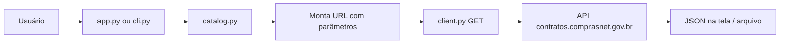

# Sistema de Consulta — API Contratos.gov.br

Consulta **profissional, organizada e portável** à API pública de contratos do governo federal, usando **somente endpoints que não exigem login**.

- Documentação oficial: https://contratos.comprasnet.gov.br/api/docs  
- Especificação OpenAPI: https://contratos.comprasnet.gov.br/docs/api-docs.json  

---

## O que este sistema faz

| Recurso | Descrição |
|---------|-----------|
| **Interface web** | Formulários por endpoint, visualização JSON, download de resultados |
| **Linha de comando (CLI)** | Automação, scripts e integração em pipelines |
| **Catálogo completo** | Todos os 70 paths documentados, com indicação público vs. autenticado |
| **Sem credenciais** | Não armazena senhas, não chama login, não altera dados na API |

---

## Endpoints públicos (funcionam sem token)

Estes **20 endpoints GET** estão marcados na OpenAPI **sem** `bearerAuth` e foram testados sem autenticação:

| Categoria | Endpoint |
|-----------|----------|
| Referência | `GET /api/contrato/orgaos` |
| Referência | `GET /api/contrato/unidades` |
| Contrato por ID | `GET /api/contrato/id/{contrato_id}` |
| Por UG | `GET /api/contrato/ug/{unidade_codigo}` |
| Por UG (inativos) | `GET /api/contrato/inativo/ug/{unidade_codigo}` |
| Por UASG + número | `GET /api/contrato/ugorigem/{codigo_uasg}/numeroano/{numero_contrato}` |
| Detalhes do contrato | `GET /api/contrato/{contrato_id}/cronograma` |
| | `GET /api/contrato/{contrato_id}/empenhos` |
| | `GET /api/contrato/{contrato_id}/historico` |
| | `GET /api/contrato/{contrato_id}/garantias` |
| | `GET /api/contrato/{contrato_id}/itens` |
| | `GET /api/contrato/{contrato_id}/prepostos` |
| | `GET /api/contrato/{contrato_id}/responsaveis` |
| | `GET /api/contrato/{contrato_id}/despesas_acessorias` |
| | `GET /api/contrato/{contrato_id}/faturas` |
| | `GET /api/contrato/{contrato_id}/ocorrencias` |
| | `GET /api/contrato/{contrato_id}/terceirizados` |
| | `GET /api/contrato/{contrato_id}/arquivos` |
| | `GET /api/contrato/{contrato_id}/publicacoes` |
| | `GET /api/contrato/{contrato_id}/domiciliobancario` |

### Endpoints que exigem login (não usados aqui)

Rotas como `/api/v1/contrato`, `/api/v1/empenho`, usuários, apropriação, etc. retornam **HTTP 401** sem token JWT (`POST /api/v1/auth/login`). O catálogo do sistema lista essas rotas apenas como **referência**, com aviso explícito.

---

## Estrutura do projeto

```
contratos-consulta/
├── README.md                 ← Este arquivo (apresentação)
├── requirements.txt          ← Dependências Python (httpx, streamlit, rich)
├── data/
│   └── api-docs.json         ← Cópia local da OpenAPI (catálogo offline)
├── output/                   ← JSON exportados pelas consultas
├── scripts/
│   ├── setup.sh / setup.bat  ← Instalação (Linux/macOS / Windows)
│   ├── run_web.sh / .bat     ← Inicia interface web
│   └── run_cli.sh / .bat     ← Linha de comando
└── src/contratos_consulta/
    ├── config.py             ← URLs e caminhos
    ├── api/
    │   ├── catalog.py        ← Leitura e classificação OpenAPI
    │   └── client.py         ← Cliente HTTP (somente leitura)
    ├── app.py                ← Interface Streamlit
    └── cli.py                ← Interface terminal
```

### Fluxo de uma consulta



---

## Requisitos

- **Python 3.10+** (qualquer SO: Linux, Windows, macOS)
- Conexão com internet (chamadas à API federal)
- ~50 MB de espaço (ambiente virtual + dependências)

Não instala serviços de sistema, não altera configuração do SO e não exige privilégios de administrador.

---

## Instalação rápida

### Linux / macOS

```bash
cd contratos-consulta
chmod +x scripts/*.sh
./scripts/setup.sh
./scripts/run_web.sh
```

Abra no navegador o endereço exibido (geralmente `http://localhost:8501`).

**Se aparecer erro de `python3-venv`:** o setup instala no seu usuário (`~/.local`) e funciona mesmo assim. Opcionalmente, para ambiente virtual isolado:

```bash
sudo apt install python3.12-venv
rm -rf .venv
./scripts/setup.sh
```

### Windows

```cmd
cd contratos-consulta
scripts\setup.bat
scripts\run_web.bat
```

---

## Uso — Interface web

1. **Consulta pública** — escolha categoria → endpoint → preencha parâmetros → *Executar consulta*
2. **Catálogo completo** — visão de toda a API com badges público/autenticado
3. **Explorador GET** — testa qualquer GET documentado (com aviso se precisar de login)
4. **Ajuda** — documentação integrada para apresentação

---

## Uso — Linha de comando

```bash
# Listar endpoints públicos
./scripts/run_cli.sh list --public-only

# Consulta rápida: órgãos com contratos ativos
./scripts/run_cli.sh quick orgaos

# Contrato por ID
./scripts/run_cli.sh consult \
  --endpoint "GET:/api/contrato/id/{contrato_id}" \
  --param contrato_id=SEU_ID

# Contratos ativos de uma UG
./scripts/run_cli.sh consult \
  --endpoint "GET:/api/contrato/ug/{unidade_codigo}" \
  --param unidade_codigo=200999 \
  -o output/contratos_ug.json
```

---

## Replicação em outro computador / SO

1. Copie a pasta `contratos-consulta` inteira (USB, git, zip).
2. Instale Python 3.10+ no destino.
3. Execute o `setup` do SO correspondente (`.sh` ou `.bat`).
4. Use `run_web` ou `run_cli` — mesma estrutura em qualquer máquina.

Para atualizar o catálogo de endpoints:

```bash
curl -s "https://contratos.comprasnet.gov.br/docs/api-docs.json" \
  -o data/api-docs.json
```

---

## Segurança e boas práticas

- Apenas requisições **GET** na aba principal (leitura).
- Timeout configurável (60 s); sem loops agressivos.
- Resultados opcionais em `output/` (pasta local do projeto).
- Não inclua credenciais em arquivos de configuração.

---

## Licença da API

A API é licenciada sob **Apache 2.0** conforme documentação oficial.
