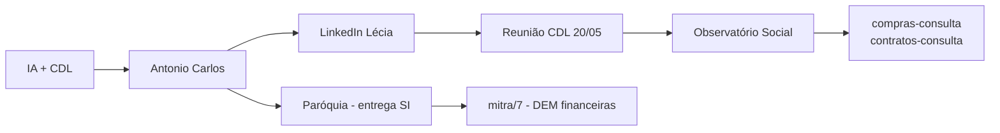

# Índice — Trilha do Projeto Extensionista

> **Aluno:** Diôgo Ferreira Moura — Sistemas de Informação (Uniube)  
> **Orientação:** Profª Leandra Mendes do Vale  
> **Fonte primária:** [[logs.txt]]  
> **Documento mestre:** [[Trilha do Projeto - Evolução Completa]]

---

## Navegação rápida

| Fase | Período | Nota |
|------|---------|------|
| 1 | Mar/2026 | [[Fase 1 - Proposta CDL e Inteligência Artificial]] |
| 2 | Mar/2026 | [[Fase 2 - Ponte Antonio Carlos e briefing]] |
| 3 | Abr/2026 | [[Fase 3 - Entrega acadêmica via paróquia]] |
| 4 | Abr–Mai/2026 | [[Fase 4 - Articulação CDL LinkedIn e WhatsApp]] |
| 5 | Mai/2026 | [[Fase 5 - Reunião CDL e redirecionamento OSB]] |
| 6 | Mai/2026 | [[Fase 6 - Observatório Social Uberlândia]] |
| — | Mai/2026+ | [[Artefatos técnicos do repositório]] |

---

## Visão em uma linha

---

## Stakeholders

- [[Stakeholders e contatos]]
- [[Links externos - referências]]

---

## Repositório local

| Pasta | Descrição |
|-------|-----------|
| [[Artefatos técnicos do repositório]] | Sistemas de consulta e dados municipais |
| `../compras-consulta/` | API Compras.gov.br (dados abertos) |
| `../contratos-consulta/` | API Contratos Comprasnet |
| `../arquivo_download/` | CSVs Uberlândia (licitações, contratos, obras) |
| `../../mitra/7/` | App paróquia — demonstrações financeiras (DEM) |

---

## Como usar no Obsidian

1. Abra a pasta **`docs/`** como vault (já existe configuração em `.obsidian/`).
2. Comece por esta nota ou por [[Trilha do Projeto - Evolução Completa]].
3. Use o **Graph view** para ver conexões entre fases e artefatos.
4. Atualize a seção *Próximos passos* em [[Trilha do Projeto - Evolução Completa]] após cada reunião.
