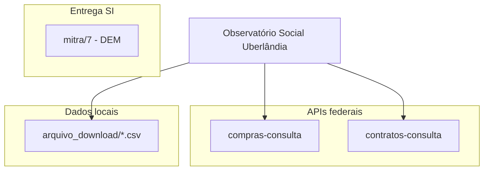

# Artefatos técnicos do repositório

[[00 - Índice - Trilha do Projeto|← Índice]] · Contexto: [[Fase 6 - Observatório Social Uberlândia]]

Repositório base: `uniube/1/` — alinhado ao controle social e análise de compras/contratos públicos.

---

## Visão geral



---

## compras-consulta

**Pasta:** [../compras-consulta/README.md](../compras-consulta/README.md)

Consulta à API de **Dados Abertos** do [Compras.gov.br](https://dadosabertos.compras.gov.br/swagger-ui/index.html) (manual API v2.0, fev/2026).

| Recurso | Descrição |
|---------|-----------|
| Interface web | Streamlit — filtros, tabela, JSON, download |
| CLI | Automação e scripts |
| Catálogo | Endpoints OpenAPI (`data/api-docs.json`) |
| Saídas | `output/consulta_*.json` |

**Início rápido:**

```bash
cd ../compras-consulta
chmod +x scripts/*.sh
./scripts/setup.sh
./scripts/run_web.sh
# http://localhost:8501
```

**Módulos:** Material, Serviço, Pesquisa de Preço, PGC, UASG, Legado, Contratações, ARP, Contratos, Fornecedor, OCDS.

---

## contratos-consulta

**Pasta:** [../contratos-consulta/README.md](../contratos-consulta/README.md)

Consulta à API pública de [Contratos Comprasnet](https://contratos.comprasnet.gov.br/api/docs) — **somente endpoints sem login** (20 GET públicos).

| Recurso | Descrição |
|---------|-----------|
| Interface web | Streamlit |
| CLI | Terminal |
| OpenAPI local | `data/api-docs.json` |
| Saídas | `output/consulta_*.json` |

**Início rápido:**

```bash
cd ../contratos-consulta
./scripts/setup.sh
./scripts/run_web.sh
```

---

## arquivo_download (CSVs municipais)

**Pasta:** [../arquivo_download/](../arquivo_download/)

Dados exportados de portais de Uberlândia para cruzamento e análise:

| Arquivo | Conteúdo (resumo) |
|---------|-------------------|
| `Contratos2026.csv` | Contratos municipais 2026 (objeto, empresa, valores) |
| `Licitacoes2026.csv` | Licitações 2026 |
| `Obras_2025.csv` | Obras públicas — links weblicitacoes/webobras |
| `GestoresContratos.csv` | Gestores e fiscais de contratos |

**Exemplo de uso:** cruzar contrato municipal (ex. SANEB) com consultas em `contratos-consulta` / `compras-consulta` quando houver correspondência federal.

---

## mitra/7 — App paróquia (demonstrações financeiras)

**Pasta:** `../../mitra/7/` (projeto irmão no monorepo)

| Tipo | Arquivos |
|------|----------|
| UI | `index*dem.html` — BP, DRE, DFC, DMPL, DRA, notas |
| SQL | `query15dre.sql`, `query16bp.sql`, `query17dfc.sql`, etc. |

→ [[Fase 3 - Entrega acadêmica via paróquia]]

---

## Documentação de apoio

| Recurso | Onde |
|---------|------|
| Log bruto da trilha | [[logs.txt]] |
| Links consolidados | [[Links externos - referências]] |
| Evolução narrativa | [[Trilha do Projeto - Evolução Completa]] |

---

## Roadmap técnico sugerido (OSB)

1. Unificar consultas federais + filtros por órgão/município relevante.
2. Importar e versionar CSVs municipais com data de extração.
3. Relatórios comparativos (licitação → contrato → obra).
4. Interface única ou dashboard para voluntários OSB.
