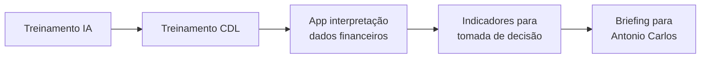

# Fase 2 — Ponte Antonio Carlos e briefing

[[00 - Índice - Trilha do Projeto|← Índice]] · Anterior: [[Fase 1 - Proposta CDL e Inteligência Artificial]] · Próxima: [[Fase 3 - Entrega acadêmica via paróquia]]

**Datas:** 16/03/2026 · **Intermediário:** Antonio Carlos Oliveira

---

## Contato estratégico

| Campo | Informação |
|-------|------------|
| Nome | Antonio Carlos Oliveira |
| Vínculo | Ex-professor ESAMC (Administração, ~2007); Virtual Serviços |
| Papel na CDL | Conselho e diretoria; iniciativas para associados |
| LinkedIn | [antonio-carlos-oliveira-95713a65](https://www.linkedin.com/in/antonio-carlos-oliveira-95713a65/) |
| Reunião | 16/03/2026 às 14h |

---

## Evolução da proposta (pós-conversa)

1. **Treinamento** voltado aos associados da CDL.
2. **Aplicativo simples** como apoio pós-treinamento.
3. **Objetivo do app:** interpretar dados financeiros → indicadores de gestão.
4. **Entrega:** briefing objetivo para avaliação e ponte institucional.

---

## Plano alternativo (fundação social)

Caso a CDL não avance diretamente:

- Treinamento para clientes de **fundação com foco social** (mencionada por Antonio Carlos).
- Função: validar conteúdo e metodologia antes de escala.

---

## Feedback da orientadora (17/03)

Profª Leandra validou:

- Caminho via contato interno CDL.
- Maturidade da proposta com app financeiro.
- Planos principal e alternativo.

---

## Pendências herdadas desta fase

- [ ] Finalizar e enviar **briefing** estruturado a Antonio Carlos
- [ ] Atualizar briefing com aprendizados do [[Fase 5 - Reunião CDL e redirecionamento OSB|OSB]] (mai/2026)
