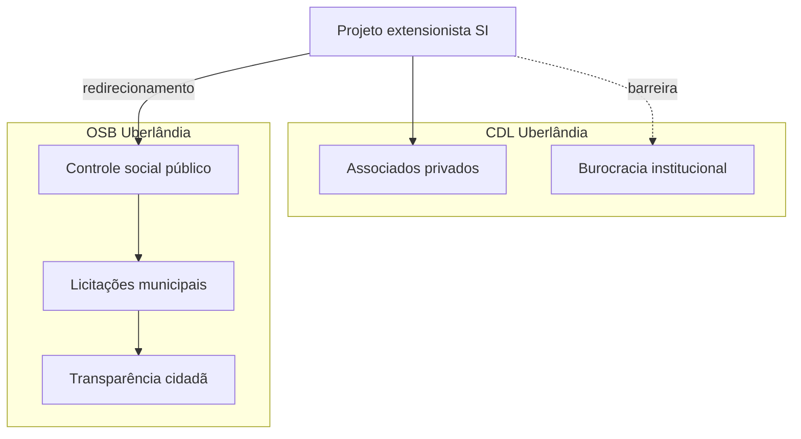

# Fase 5 — Reunião CDL e redirecionamento OSB

[[00 - Índice - Trilha do Projeto|← Índice]] · Anterior: [[Fase 4 - Articulação CDL LinkedIn e WhatsApp]] · Próxima: [[Fase 6 - Observatório Social Uberlândia]]

**Data:** 20/05/2026 · **Hora:** 14h · **Local:** CDL Uberlândia  
**Participante CDL:** Lécia Queiroz

---

## O que foi apresentado

- Necessidade extensionista em detalhes.
- Discussão ampla sobre contexto institucional e sensibilidades da CDL.

---

## Avaliação institucional (CDL)

> [!important] Conclusão da reunião
> Implementar o projeto **diretamente dentro da CDL** seria **burocrático e inviável** no momento — envolve muitas esferas sensíveis ligadas ao papel institucional da entidade.

Isso **não encerra** o trabalho extensionista; redireciona o parceiro e o tipo de impacto.

---

## Encaminhamento — Observatório Social

**Indicação:** [Observatório Social do Brasil — Uberlândia](https://www.osbrasiluberlandia.org/)

| Aspecto | Descrição |
|---------|-----------|
| Natureza | Entidade **sem fins lucrativos**, apartidária |
| Missão | Vigilância social das contas públicas (prefeitura, autarquias) |
| Escopo | Licitações, execução orçamentária, entregas do legislativo municipal |
| Fit com SI | Ferramentas de dados, transparência, análise — alinhado ao perfil técnico do projeto |
| Ação na reunião | Lécia contatou **Marco Aurélio** e passou o contato |

---

## Por que o encaminhamento faz sentido

---

## Próximo passo imediato (log)

Contato com **Marco Aurélio** → reunião **21/05/2026 às 14h30** no OSB.

→ [[Fase 6 - Observatório Social Uberlândia]]

---

## Frente CDL — status após reunião

- Treinamento IA / app associados: **pausado** como entrega direta na CDL.
- Relacionamento com Lécia e Antonio Carlos: **mantido** para futuras oportunidades (ex.: Fundação CDL, outras frentes).
