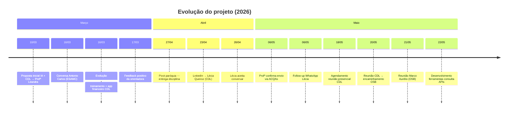
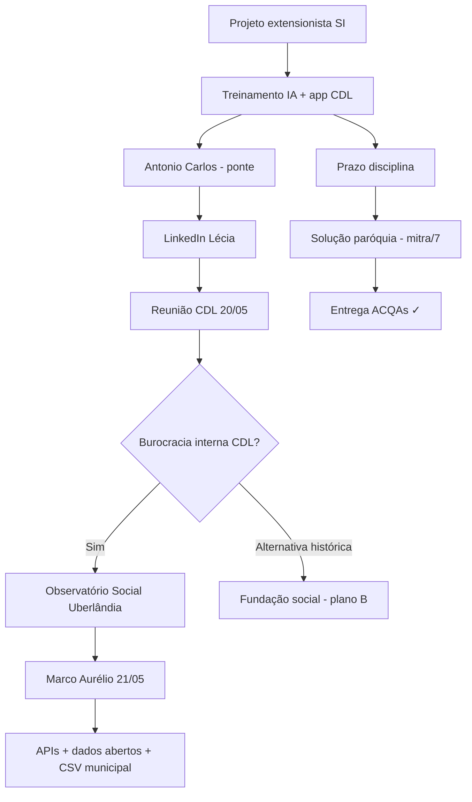

# Trilha do Projeto Extensionista — Evolução Completa

[[00 - Índice - Trilha do Projeto|← Voltar ao índice]] · Fonte: [[logs.txt]]

---

## Resumo executivo

Trabalho extensionista em **Sistemas de Informação (Uniube)** com duas frentes que evoluem em paralelo:

1. **Frente empresarial (CDL):** treinamento em IA + app de indicadores financeiros para associados — articulação lenta, com ponte via ex-professor Antonio Carlos.
2. **Frente acadêmica cumprida:** solução com **paróquia local** (app de demonstrações financeiras) entregue no prazo da disciplina.
3. **Frente cidadã (atual):** após reunião na CDL (20/05/2026), redirecionamento ao **Observatório Social do Brasil — Uberlândia**, alinhado ao controle social de contas públicas, licitações e transparência — com desenvolvimento de ferramentas de consulta a dados abertos (`compras-consulta`, `contratos-consulta`) e bases municipais.

---

## Linha do tempo

---

## Cronologia detalhada

### 10/03/2026 — Proposta inicial (e-mail → Leandra)

**Assunto:** Treinamento rápido em IA para empresários da CDL Uberlândia.

**Ideia central:** Reduzir a lacuna entre “ouvir falar” de Inteligência Artificial e “saber usar” no dia a dia da gestão — produtividade, comunicação, atendimento, análise de dados e decisão.

→ Detalhes: [[Fase 1 - Proposta CDL e Inteligência Artificial]]

---

### 16/03/2026 (manhã) — Estratégia de ponte institucional

Reunião agendada com **Antonio Carlos** (ex-professor ESAMC, Administração 2007), indicado como canal para a CDL antes de abordagem direta.

→ [[Fase 2 - Ponte Antonio Carlos e briefing]]

---

### 16/03/2026 (tarde) — Conversa produtiva e evolução da proposta

**Resultados:**

- Necessidade de **briefing objetivo** para apresentar a ideia.
- Proposta ampliada: **treinamento para associados CDL** + **aplicativo simples** para interpretar dados financeiros e gerar indicadores de decisão.
- Antonio Carlos: conselho/diretoria CDL; pode fazer ponte institucional.
- **Plano B:** treinamento via fundação social ligada a ele (validação de conteúdo).

---

### 17/03/2026 — Retorno da Profª Leandra

Validação da estratégia (contato interno CDL), do app financeiro e dos planos principal/alternativo. Orientação: foco no briefing.

---

### 27/04/2026 — Ajuste de rota (entrega da disciplina)

**Motivo:** Dificuldades de articulação institucional no prazo acadêmico.

**Solução adotada:** Aproximação com **paróquia local** → demanda real com padre → app como solução → projeto submetido no prazo.

**Links informados à professora** (preencher URLs reais se ainda não estiverem no e-mail original):

| Recurso | Status no log |
|---------|----------------|
| Demo do aplicativo | *Placeholder no log — inserir URL* |
| Download do aplicativo | *Placeholder no log — inserir URL* |

**Implementação técnica local (paróquia):** módulo de demonstrações contábeis em `../../mitra/7/` (HTML + SQL: BP, DRE, DFC, DMPL, DRA, notas explicativas).

→ [[Fase 3 - Entrega acadêmica via paróquia]]

**Frente CDL:** mantida em paralelo, com avanço mais lento.

---

### 06/05/2026 — Confirmação acadêmica

Profª Leandra: enviar trabalhos pelo espaço das **ACQAs**; mensagem de apoio ao projeto.

---

### 23–27/04/2026 — Articulação CDL (LinkedIn)

| Data | Evento |
|------|--------|
| 23/04 06:12 | Mensagem LinkedIn a **Lécia Queiroz** (indicação Antonio Carlos) |
| 26/04 18:42 | Lécia responde; pede contato WhatsApp **(34) 99991-5476** |
| 27/04 09:45 | Diogo confirma combinação |

→ [[Fase 4 - Articulação CDL LinkedIn e WhatsApp]] · [[Stakeholders e contatos]]

---

### 06–18/05/2026 — WhatsApp e agendamento

- 06/05: Lécia em viagem; retorno na semana do **18/05**.
- 18/05: Disponibilidade online ou **presencial** quarta/quinta tarde.
- Agendado: **quarta 21/05 às 14h** — CDL, Av. Belo Horizonte 1290, Osvaldo Rezende.
- E-mail convite: `diogo.moura@triggerti.com`

> [!note] Correção de datas no log
> O WhatsApp marca reunião na **quarta 13h** → confirmada **14h**. O encontro presencial ocorreu em **20/05/2026 às 14h** (anotação pós-reunião no log).

---

### 20/05/2026 — Reunião presencial na CDL (Lécia Queiroz)

**Local:** [CDL Uberlândia](https://cdludi.org.br/) — Av. Belo Horizonte, 1290, Osvaldo Rezende.

**Conteúdo:**

- Apresentação detalhada da necessidade extensionista.
- Conversa ampla sobre aspectos institucionais.
- **Avaliação:** implementar algo *dentro* da CDL seria burocrático e inviável (muitas esferas sensíveis à função institucional).
- **Encaminhamento:** [Observatório Social do Brasil — Uberlândia](https://www.osbrasiluberlandia.org/) — ONG apartidária, controle social de contas públicas municipais, autarquias e entregas do legislativo.
- **Ação imediata:** Lécia contatou **Marco Aurélio** (responsável OSB) e passou o contato.

→ [[Fase 5 - Reunião CDL e redirecionamento OSB]]

---

### 21/05/2026 — Reunião no Observatório Social (14h30)

**Contato:** Marco Aurélio Freitas Santos (OSB Uberlândia).

**Local:** Rua Padre Pio, 700 — Osvaldo Rezende ([site institucional](https://www.osbrasiluberlandia.org/)).

**Resultado:** Apresentação da entidade; alinhamento inicial sobre trabalhos de contribuição tecnológica (vigilância social, licitações, transparência).

→ [[Fase 6 - Observatório Social Uberlândia]]

---

### 22/05/2026 em diante — Artefatos técnicos no repositório

Desenvolvimento de ferramentas de consulta alinhadas ao monitoramento de compras e contratos públicos:

- **compras-consulta** — API Dados Abertos [Compras.gov.br](https://dadosabertos.compras.gov.br/swagger-ui/index.html)
- **contratos-consulta** — API [Contratos Comprasnet](https://contratos.comprasnet.gov.br/api/docs)
- **arquivo_download/** — CSVs locais Uberlândia (contratos, licitações, obras, gestores)

→ [[Artefatos técnicos do repositório]]

---

## Mapa de decisões

---

## Entregas por frente

| Frente | Status (mai/2026) | Evidência |
|--------|-------------------|-----------|
| Disciplina (paróquia) | Concluída no prazo | App DEM + e-mail 27/04 |
| CDL (treinamento/app associados) | Em articulação | LinkedIn, WhatsApp, reunião 20/05 |
| OSB (contribuição técnica) | Em início | Reunião 21/05; repos `*-consulta` |
| Briefing Antonio Carlos | Pendente/atualizar | Encaminhamento pós-16/03 |

---

## Próximos passos (atualizar conforme avanço)

- [ ] Consolidar escopo de trabalho com Marco Aurélio (OSB)
- [ ] Integrar consultas federais (Compras/Contratos) com dados municipais (`arquivo_download/`)
- [ ] Inserir URLs reais de **demo** e **download** do app paróquia na nota [[Fase 3 - Entrega acadêmica via paróquia]]
- [ ] Atualizar briefing para Antonio Carlos / CDL com aprendizados do OSB
- [ ] Registrar atas de reunião OSB nesta trilha

---

## Ver também

- [[Stakeholders e contatos]]
- [[Links externos - referências]]
- [[logs.txt]] (texto bruto)
