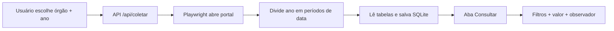

# Licitações Hub — detalhamento do projeto em http://localhost:8080

## Em linguagem leiga

### O que é?

É uma **ferramenta web simples** que ajuda a equipe do Observatório Social (e quem acompanha licitações públicas) a **não depender só de planilha manual**.

Hoje, no operacional descrito no `Andamento.txt`, alguém entra no site da Prefeitura de Uberlândia, copia dados de licitação, monta um **Cronograma** e depois um **Acompanhamento** (como nos prints `Cronograma.jpeg`, `Acompanhamento_1.jpeg` e `Acompanhamento_2.jpeg`).

O **Licitações Hub** automatiza a **primeira etapa**: ele “visita” o portal oficial, **baixa a lista de licitações** (órgão + ano), **guarda tudo num banco local** e permite **consultar, filtrar e anotar** depois — sem precisar refazer a busca no site toda vez.

### O que você faz na tela (http://localhost:8080)

| Aba | Para que serve |
|-----|----------------|
| **Coletar** | Escolhe o órgão (Prefeitura, DMAE, IPREMU etc.) e o ano; o sistema busca no portal e salva |
| **Consultar** | Vê tudo que já foi salvo, filtra por ano/órgão/modalidade/situação/texto, edita valor estimado e observador |
| **Observadores** | Cadastra quem acompanha cada licitação (nome, e-mail, telefone) |

### Por que isso é útil?

- **Economiza tempo** — não precisa abrir o portal e copiar linha por linha
- **Não perde anotações** — se você sincronizar de novo, o sistema atualiza dados do portal mas **mantém** valor estimado e observador que você preencheu
- **Organiza o trabalho** — vira uma base consultável, parecida com a lógica da planilha de acompanhamento, porém digital e pesquisável

### De onde vêm os dados?

Do portal oficial da Prefeitura:

https://weblicitacoes.uberlandia.mg.gov.br/weblicitacoes/f/n/licitacoescon?evento=y&descricaoEmpresaLicitacao=2&modoJanelaPlc=popup

O sistema simula o que uma pessoa faria no navegador: escolher órgão, escolher ano e ler a tabela de processos.

---

## Em linguagem técnica

### Arquitetura

```
┌─────────────────────────────────────────────────────────┐
│  Navegador (você)  →  http://localhost:8080             │
└───────────────────────────┬─────────────────────────────┘
                            │
┌───────────────────────────▼─────────────────────────────┐
│  Container Docker único: licitacoes-hub-app             │
│  ┌─────────────┐  ┌──────────────┐  ┌───────────────┐  │
│  │ FastAPI     │  │ Playwright   │  │ SQLite        │  │
│  │ (API+UI)    │  │ (scraper)    │  │ (persistência)│  │
│  └─────────────┘  └──────────────┘  └───────────────┘  │
│         │                  │                  │          │
│         └──────────────────┴──────────────────┘          │
│                    volume: ./data/licitacoes.db          │
└───────────────────────────┬─────────────────────────────┘
                            │ HTTPS
┌───────────────────────────▼─────────────────────────────┐
│  Portal JSF: weblicitacoes.uberlandia.mg.gov.br         │
└─────────────────────────────────────────────────────────┘
```

- **1 container Docker** (`docker compose up --build -d`)
- **FastAPI** serve API REST + arquivos estáticos (HTML/CSS/JS)
- **Playwright + Chromium** faz a coleta automatizada (com Xvfb no Docker)
- **SQLite** em `licitacoes-hub/data/licitacoes.db` (volume persistente)

### Stack

| Camada | Tecnologia |
|--------|------------|
| Backend | Python 3, FastAPI, SQLAlchemy, Pydantic |
| Scraper | Playwright (Chromium, modo visível no Docker via Xvfb) |
| Banco | SQLite |
| Frontend | HTML + CSS + JavaScript vanilla (sem React/Vue) |
| Deploy | Docker + docker-compose, porta **8080** |

### Coleta de dados (ponto crítico)

O portal usa **JSF/RichFaces** com paginação AJAX. Testes mostraram que, após a 1ª página (100 registros), o botão “próximo” devolve dados incorretos (ex.: 2 registros de 2023 em vez dos 76 restantes de 2026).

**Solução implementada** em `app/scraper.py`:

1. Divide o ano em **intervalos de data** (`01/01/AAAA` – `31/12/AAAA`)
2. Se um período tiver **> 100 registros**, subdivide ao meio recursivamente
3. Cada janela fica em **uma única página** (sem paginação quebrada)
4. **Deduplica** por `processo`
5. Paginação clássica fica só como fallback extremo

Exemplo validado: PMU 2026 → **176/176 registros** coletados.

### Modelo de dados (SQLite)

**Tabela `licitacoes`**

- Dados do portal: processo, modalidade, descrição, datas, situação, URL de detalhe, órgão, ano
- Campos manuais: `valor_estimado`, `observador_id`
- Índice único: `(empresa_codigo, processo, ano)`

**Tabela `observadores`**

- nome, email, telefone, ativo

**Re-sync seguro:** `CAMPOS_PRESERVADOS_SYNC = {valor_estimado, observador_id}` — não são sobrescritos na nova coleta.

### APIs principais

| Método | Rota | Função |
|--------|------|--------|
| GET | `/` | Interface web |
| POST | `/api/coletar` | Inicia coleta em background |
| GET | `/api/coletar/status` | Log e progresso da coleta |
| GET | `/api/licitacoes` | Lista com filtros e paginação |
| PATCH | `/api/licitacoes/{id}` | Atualiza valor/observador |
| GET/POST/PATCH | `/api/observadores` | CRUD observadores |
| GET | `/api/empresas`, `/api/modalidades`, `/api/situacoes`, `/api/stats` | Metadados |

### Órgãos suportados (código → nome)

| Cód. | Órgão |
|------|-------|
| 0 | Prefeitura Municipal de Uberlândia |
| 1 | DMAE |
| 2 | IPREMU |
| 3 | PRODAUB |
| 4 | FUTEL |
| 5 | FERUB |
| 6 | EMAM |
| 7 | FUNDASUS |
| 8 | Câmara Municipal |
| 9 | ARESAN |

### Como subir

```bash
cd licitacoes-hub
docker compose up --build -d
```

Acesso: **http://localhost:8080**

---

## Pastas do projeto (estrutura interna)

Tudo que compõe o `localhost:8080` está em **`licitacoes-hub/`**:

```
licitacoes-hub/
├── app/
│   ├── main.py          # FastAPI: APIs, coleta em background, serve a UI
│   ├── scraper.py       # Playwright: coleta por intervalos de data
│   ├── database.py      # Modelos SQLite + migração automática de colunas
│   ├── config.py        # URLs do portal, órgãos, delays
│   └── static/
│       ├── index.html   # 3 abas: Coletar, Consultar, Observadores
│       ├── app.js       # Chamadas à API e interação da tela
│       └── style.css    # Visual da interface
├── data/
│   └── licitacoes.db    # Banco (criado ao rodar; persistido no volume Docker)
├── scripts/             # Scripts de diagnóstico de paginação (desenvolvimento)
├── Dockerfile           # Imagem com Python + Playwright + Xvfb
├── docker-compose.yml   # Sobe 1 serviço na porta 8080
├── entrypoint.sh        # Inicia Xvfb + uvicorn
├── requirements.txt     # Dependências Python
├── README.md            # Documentação rápida
└── DOCUMENTACAO.md      # Este documento
```

---

## Pastas na raiz (`uniube/1/`) relacionadas a este projeto

Considerando **somente** o que se conecta ao conteúdo atual de http://localhost:8080:

### Diretamente ligadas

| Pasta / arquivo | Relação |
|-----------------|---------|
| **`licitacoes-hub/`** | **O projeto inteiro** que roda em `localhost:8080` |
| **`Andamento.txt`** | Contexto do trabalho extensionista (OSB Uberlândia): descreve o operacional manual de acompanhamento de licitações que esta ferramenta digitaliza em parte |
| **`Cronograma.jpeg`** | Referência visual do fluxo manual (planilha cronograma) — o Hub substitui a etapa de extração do portal |
| **`Acompanhamento_1.jpeg`** | Referência visual do acompanhamento que a equipe faz hoje — o Hub alimenta essa etapa com dados estruturados |
| **`Acompanhamento_2.jpeg`** | Idem — modelo de acompanhamento usado pela ONG |
| **`arquivo_download/`** | CSVs exportados do portal municipal (ex.: `Licitacoes2026.csv`) — servem como **referência/comparação** para validar se a coleta automática está correta |

### Não fazem parte do `localhost:8080` (fora do escopo atual)

| Pasta / arquivo | Motivo |
|-----------------|--------|
| `weblicitacoes-platform/` | Versão anterior mais complexa (vários containers, portas 3000/8000) — **abandonada** |
| `weblicitacoes-consulta/` | Protótipo Streamlit anterior — **não é** o que roda na 8080 |
| `compras-consulta/` | Consulta API federal Compras.gov — outro módulo |
| `contratos-consulta/` | Consulta API federal de contratos — outro módulo |
| `docs/` | Documentação geral da trilha do projeto (várias fases) — contexto amplo, não é o app 8080 |
| `gerar_pdf_relatorio.py`, `relatorio_inicial_contexto.*`, PDFs diversos | Materiais acadêmicos/relatórios — não são o sistema web |

---

## Fluxo resumido (do clique à consulta)



---

## Em uma frase

O **Licitações Hub** (`http://localhost:8080`) é um sistema Docker simples que **coleta licitações do portal da Prefeitura de Uberlândia**, **armazena localmente** e permite **consultar e acompanhar** cada processo — com proteção para não perder anotações na re-sincronização — no contexto do trabalho do Observatório Social descrito no `Andamento.txt`.
