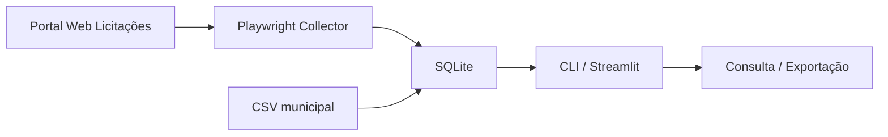

# Web Licitações — Uberlândia

Sistema profissional para **capturar**, **persistir** e **consultar** licitações do portal municipal [Web Licitações — Prefeitura de Uberlândia](https://weblicitacoes.uberlandia.mg.gov.br/weblicitacoes/f/n/licitacoescon).

Desenvolvido para apoiar o acompanhamento de licitações do **Observatório Social do Brasil — Uberlândia**.

---

## O que este sistema faz

| Recurso | Descrição |
|---------|-----------|
| **Coleta automatizada** | Playwright navega o portal e extrai licitações por órgão e ano |
| **Banco SQLite** | Persistência local com deduplicação e histórico de sincronizações |
| **Interface web** | Streamlit — consulta, filtros, painel e coleta |
| **CLI** | Automação via terminal (coleta, consulta, importação CSV, stats) |
| **Importação CSV** | Fallback para CSVs exportados manualmente do portal |

---

## Estrutura do projeto

```
weblicitacoes-consulta/
├── README.md
├── requirements.txt
├── data/
│   └── weblicitacoes.db      ← banco SQLite (gerado na 1ª execução)
├── output/                   ← exportações JSON/CSV
├── scripts/
│   ├── setup.sh / setup.bat
│   ├── run_web.sh / run_web.bat
│   └── run_cli.sh / run_cli.bat
└── src/weblicitacoes_consulta/
    ├── config.py             ← URLs, empresas, caminhos
    ├── db/
    │   ├── models.py         ← SQLAlchemy (licitacoes, sync_runs)
    │   └── repository.py     ← CRUD e consultas
    ├── scraper/
    │   └── collector.py      ← Playwright — coleta paginada
    ├── services.py           ← persistência e import CSV
    ├── cli.py                ← linha de comando
    └── app.py                ← interface Streamlit
```

### Fluxo de dados



---

## Requisitos

- **Python 3.10+**
- **Chromium** (instalado via `playwright install chromium`)
- Conexão com internet
- ~200 MB (ambiente + navegador)

> **Nota:** O portal usa proteção WAF (Akamai) que pode bloquear acesso headless ou de datacenters. Execute a coleta em máquina local com **navegador visível** (`--headed`, padrão).

---

## Instalação

### Linux / macOS

```bash
cd weblicitacoes-consulta
chmod +x scripts/*.sh
./scripts/setup.sh
./scripts/run_web.sh
```

Abra: **http://localhost:8501**

### Windows

```cmd
cd weblicitacoes-consulta
scripts\setup.bat
scripts\run_web.bat
```

---

## Uso — Interface web

1. **Consulta** — filtros por ano, órgão, situação, modalidade e texto livre
2. **Coleta** — sincroniza dados do portal ou importa CSV
3. **Painel** — estatísticas e histórico de sincronizações
4. **Ajuda** — documentação integrada

---

## Uso — Linha de comando

```bash
# Listar órgãos disponíveis
./scripts/run_cli.sh empresas

# Coletar licitações de 2026 (todas as empresas)
./scripts/run_cli.sh coletar --ano 2026

# Coletar apenas DMAE (código 1)
./scripts/run_cli.sh coletar --ano 2026 --empresa 1

# Importar CSV existente
./scripts/run_cli.sh importar-csv ../arquivo_download/Licitacoes2026.csv

# Consultar licitações em andamento
./scripts/run_cli.sh consultar --ano 2026 --situacao "Em andamento"

# Busca textual
./scripts/run_cli.sh consultar --texto "pregão" --limit 20

# Exportar consulta
./scripts/run_cli.sh consultar --ano 2026 -o licitacoes_2026.json

# Estatísticas do banco
./scripts/run_cli.sh stats
```

---

## Órgãos monitorados

| Código | Órgão |
|--------|-------|
| 0 | Prefeitura Municipal de Uberlândia |
| 1 | DMAE |
| 2 | IPREMU |
| 3 | PRODAUB |
| 4 | FUTEL |
| 5 | FERUB |
| 6 | EMAM |
| 7 | FUNDASUS |
| 8 | Câmara Municipal |
| 9 | ARESAN |

---

## Modelo de dados

Cada licitação armazena: processo, órgão, ano, modalidade, descrição/objeto, datas (abertura, habilitação, julgamento, homologação), situação, link de detalhe, fonte (`scraper` ou `csv`) e timestamps de captura/atualização.

Sincronizações registram: início/fim, status, novos/atualizados e filtros aplicados.

---

## Boas práticas

- Respeite o portal: intervalo entre requisições (~1,5 s) já configurado
- Prefira coletas incrementais por ano/órgão
- Use importação CSV quando a coleta automatizada não estiver disponível
- Não inclua credenciais em arquivos de configuração

---

## Licença

Dados públicos do Município de Uberlândia. Uso para fins de controle social e transparência.
