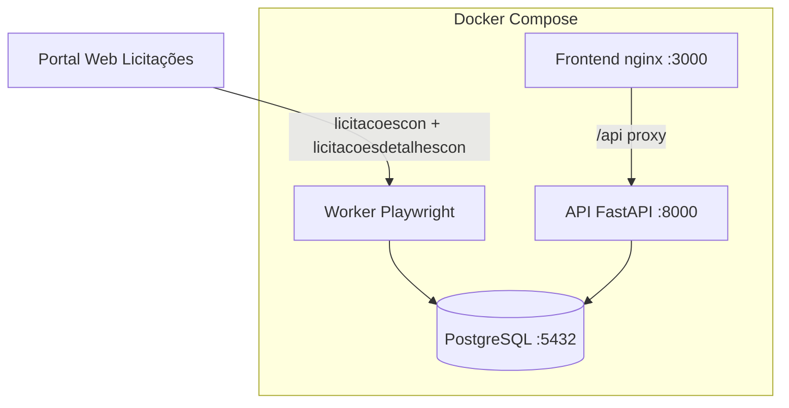

# Web Licitações Platform — Uberlândia

Plataforma profissional em **Docker** para capturar, persistir e consultar licitações do portal municipal [Web Licitações](https://weblicitacoes.uberlandia.mg.gov.br/weblicitacoes/f/n/licitacoescon?evento=y&descricaoEmpresaLicitacao=1&modoJanelaPlc=popup).

Desenvolvida para o **Observatório Social do Brasil — Uberlândia**.

---

## Arquitetura



| Serviço | Função |
|---------|--------|
| **db** | PostgreSQL 16 — pronto para migrar URL para nuvem |
| **api** | REST API — consulta, stats, enfileiramento de sync |
| **worker** | Playwright — coleta listagem + detalhes + arquivos |
| **frontend** | Interface web clean — consulta, sync, painel |

### Escalabilidade futura

- Troque `DATABASE_URL` no `.env` para um PostgreSQL na nuvem (RDS, Supabase, etc.)
- Backend e frontend continuam locais ou em qualquer host
- Worker pode ser replicado (fila via tabela `sync_jobs`; Redis opcional depois)

---

## Campos persistidos

Todos os campos são gravados mesmo quando nulos:

**Listagem (`licitacoescon`):** processo, descrição, datas (abertura, habilitação, julgamento, homologação), situação, órgão, ano.

**Detalhes (`licitacoesdetalhescon`):** local abertura, visita técnica (data, responsável, local saída), solicitante, valor, chave, observações, links PNCP/Compras.gov, lista de arquivos anexos.

**Metadados:** `detalhe_url`, `detalhe_coletado`, `fonte`, `capturado_em`, `atualizado_em`.

---

## Início rápido

```bash
cd weblicitacoes-platform
cp .env.example .env
docker compose up --build -d
```

Acesse:

- **Frontend:** http://localhost:3000
- **API docs:** http://localhost:8000/docs
- **Health:** http://localhost:8000/health

### Primeira coleta

1. Abra o frontend → aba **Sincronização**
2. Informe anos (ex: `2026`) e órgãos (vazio = todos os 10)
3. Marque **Coletar página de detalhes**
4. O worker processa o job automaticamente

### Coleta e proteção Akamai

O worker usa **Xvfb** (`DISPLAY=:99`) com navegador **headed** — contorna o WAF melhor que headless puro.

Configuração padrão no `.env`:

```env
SCRAPER_HEADLESS=false   # headed via Xvfb no Docker (recomendado)
SCRAPER_DELAY_SEC=2.0
SCRAPER_FORM_TIMEOUT_MS=60000
SCRAPER_MAX_RETRIES=3
```

Após alterar o `.env`, reinicie o worker:

```bash
docker compose up -d --build worker
```

---

## API

| Método | Endpoint | Descrição |
|--------|----------|-----------|
| GET | `/api/v1/licitacoes` | Lista com filtros |
| GET | `/api/v1/licitacoes/{id}` | Detalhe completo |
| GET | `/api/v1/stats` | Estatísticas |
| GET | `/api/v1/empresas` | Órgãos monitorados |
| POST | `/api/v1/sync` | Enfileira coleta |
| GET | `/api/v1/sync` | Histórico de jobs |

Exemplo:

```bash
curl -X POST http://localhost:8000/api/v1/sync \
  -H "Content-Type: application/json" \
  -d '{"anos":[2026],"coletar_detalhes":true}'
```

---

## Órgãos (filtro empresa)

| Código | Órgão |
|--------|-------|
| 0 | Prefeitura Municipal de Uberlândia |
| 1 | DMAE |
| 2 | IPREMU |
| 3 | PRODAUB |
| 4 | FUTEL |
| 5 | FERUB |
| 6 | EMAM |
| 7 | FUNDASUS |
| 8 | Câmara Municipal |
| 9 | ARESAN |

---

## Estrutura

```
weblicitacoes-platform/
├── docker-compose.yml
├── .env.example
├── backend/          # FastAPI + Alembic + PostgreSQL
├── worker/           # Playwright collector
├── frontend/         # nginx + SPA
└── shared/           # Constantes compartilhadas
```

---

## Licença / uso

Dados públicos do Município de Uberlândia. Uso para controle social e transparência.
